# Product Hands-on Lab - Platform engineering for Ops

Welcome to this Platform engineering for Ops Workshop. You'll be experimenting with Azure services in multiple labs to undestand real world scenarios. Don't worry, this is a step by step lab, you will be guided through the whole process.

During this workshop you will have the instructions to complete each steps. It is recommended to search for the answers in provided resources and links before looking at the solutions placed under the '📚 Toggle solution' panel.

<div class="task" data-title="Task">

> You will find the instructions and expected configurations for each Lab step in these yellow **TASK** boxes.
> Inputs and parameters to select will be defined, all the rest can remain as default as it has no impact on the scenario.

</div>

## Pre-requisites

Before starting this lab, be sure to set your Azure environment :

- An Azure Subscription with the **Owner** role to create and manage the labs' resources and deploy the infrastructure as code
- Register the Azure providers on your Azure Subscription if not done yet: `Microsoft.DevCenter`, `Microsoft.KeyVault`, `Microsoft.ApiManagement`, `Microsoft.Web`, `Microsoft.App`.

To be able to do the lab content you will also need:

- Basic understanding of Azure resources.
- A Github account (Free, Team or Enterprise)
- Create a [fork][repo-fork] of the repository from the **main** branch to help you keep track of your potential changes


3 development options are available:
  - 🥇 **Preferred method** : Pre-configured GitHub Codespace 
  - 🥈 Local Devcontainer
  - 🥉 Local Dev Environment with all the prerequisites detailed below

<div class="tip" data-title="Tips">

> To focus on the main purpose of the lab, we encourage the usage of devcontainers/codespace as they abstract the dev environment configuration, and avoid potential local dependencies conflict.
> 
> You could decide to run everything without relying on a devcontainer : To do so, make sure you install all the prerequisites detailed below.

</div>

### 🥇 : Pre-configured GitHub Codespace

To use a Github Codespace, you will need :
- [A GitHub Account][github-account]

Github Codespace offers the ability to run a complete dev environment (Visual Studio Code, Extensions, Tools, Secure port forwarding etc.) on a dedicated virtual machine. 
The configuration for the environment is defined in the `.devcontainer` folder, making sure everyone gets to develop and practice on identical environments : No more conflict on dependencies or missing tools ! 

Every Github account (even the free ones) grants access to 120 vcpu hours per month, _**for free**_. A 2 vcpu dedicated environment is enough for the purpose of the lab, meaning you could run such environment for 60 hours a month at no cost!

To get your codespace ready for the labs, here are a few steps to execute : 
- Start by forking the repository. Click on `Fork` and get a new copy of the repository which is now yours and that you can edit at your will.
- After you forked the repo, click on `<> Code`, `Codespaces` tab and then click on the `+` button:


- You can also provision a beefier configuration by defining creation options and select the **Machine Type** you like: 


### 🥈 : Using a local Devcontainer

This repo comes with a Devcontainer configuration that will let you open a fully configured dev environment from your local Visual Studio Code, while still being completely isolated from the rest of your local machine configuration : No more dependency conflict.
Here are the required tools to do so : 

- [Git client][git-client] 
- [Docker Desktop][docker-desktop] running
- [Visual Studio Code][vs-code] installed

Start by cloning the Hands-on Lab Platform engineering for Ops repo you just forked on your local Machine and open the local folder in Visual Studio Code.
Once you have cloned the repository locally, make sure Docker Desktop is up and running and open the cloned repository in Visual Studio Code.  

You will be prompted to open the project in a Dev Container. Click on `Reopen in Container`. 

If you are not prompted by Visual Studio Code, you can open the command palette (`Ctrl + Shift + P`) and search for `Reopen in Container` and select it: 


### 🥉 : Using your own local environment

The following tools and access will be necessary to run the lab in good conditions on a local environment :  

- [Git client][git-client] 
- [Visual Studio Code][vs-code] installed (you will use Dev Containers)
- [Azure CLI][az-cli-install] installed on your machine
- [Terraform][terraform-install] installed, this will be used for deploying the resources on Azure

Once you have set up your local environment, you can clone the Hands-on Lab Platform engineering for Ops repo you just forked on your machine, and open the local folder in Visual Studio Code and head to the next step. 

## 🔑 Sign in to Azure

<div class="task" data-title="Task">

> - Log into your Azure subscription in your environment using Azure CLI and on the [Azure Portal][az-portal] using your credentials.

</div>

<details>

<summary>📚 Toggle solution</summary>

```bash
# Login to Azure : 
# --tenant : Optional | In case your Azure account has access to multiple tenants

# Option 1 : Local Environment or Dev Container
az login --tenant <yourtenantid or domain.com>
# Option 2 : Github Codespace : you might need to specify --use-device-code parameter to ease the az cli authentication process
az login --use-device-code --tenant <yourtenantid or domain.com>

# Display your account details
az account show
# Select your Azure subscription
az account set --subscription <subscription-id>

# Register the following Azure providers if they are not already

# Microsoft DevCenter
az provider register --namespace 'Microsoft.DevCenter'
# Azure Key Vault
az provider register --namespace 'Microsoft.KeyVault'
# Azure API Management
az provider register --namespace 'Microsoft.ApiManagement'
# Azure Functions & Azure Web Apps
az provider register --namespace 'Microsoft.Web'
# Azure Container Apps
az provider register --namespace 'Microsoft.App'
```

</details>

## Deploy the infrastructure

You must deploy the infrastructure before starting the lab. 

First, you need to initialize the terraform infrastructure by running the following command:

```bash
cd terraform && terraform init
```

If you wan't to create multiple users for the lab, you can create an `env.tfvars` file inside the `terraform` folder and update it with this template:

```js
user_group_name       = "YOUR-WORKSHOP-GROUP-NAME"
domain_name           = "example.onmicrosoft.com"
user_default_password = "SET_YOUR_PASSWORD_HERE"
number_of_users       = 20
```

<div class="warning" data-title="Warning">

> Make sure to create an empty group of users inside Microsoft Entra Id with the same name provided in the `user_group_name` variable.

</div>

Then run the following command to deploy the infrastructure:

```bash
# Use the -var-file flag to specify the env.tfvars file only if you created it
terraform plan -out plan.out -var-file env.tfvars
# Deploy the infrastructure
terraform apply plan.out
```

The deployment should take a few minutes to complete.

## Create a GitHub PAT

To be able to use the Catalogs features in Azure Dev Center, you need to create a GitHub Personal Access Token (PAT) with the following permissions:

> Catalogs help you provide a set of curated IaC templates for your development teams to create environments. You can attach a catalog to a dev center make environment definitions available to all the projects associated with the dev center. You can also attach a catalog to a project to provide environment definitions to that specific project.

In GitHub, in the top right corner, click on your profile image, and then select Settings. On the left sidebar, select **Developer settings** > **Personal access tokens** > **Fine-grained tokens**, select **Generate new token**.

On the New fine-grained personal access token page, provide the following information:

Set a descriptive name for the token, an expiration date to 30 days, and select the following permissions:

In `Repository access` select **All repositories**, then expand `Repository permissions`, and for `Contents`, from the Access list, select `Read Only`.

Then click on **Generate token**. If you need more information on this mechanism you can refer to the [official documentation][az-dev-center-github-pat].

Now, open the resource group deployed previously (it's name should start with *"rg-lab-we-hol"*) and open the Key Vault. In the **Secrets** tab, you will find a secret named `Pat`, click on it and then select **New Version** and update the value with your GitHub PAT:

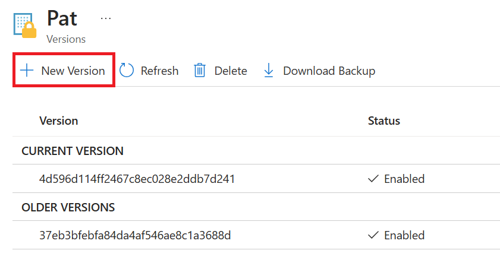

## Activate the Catalog feature

Finally, in the same resource group, open the Dev Center (name should start with *"dvc-lab-we-hol"*), go to **Settings** and then **Dev center settings** and Click on **Enable Catalog per projects**. This will allow you to define your catalogs at the project level, you will learn more about this in the lab.

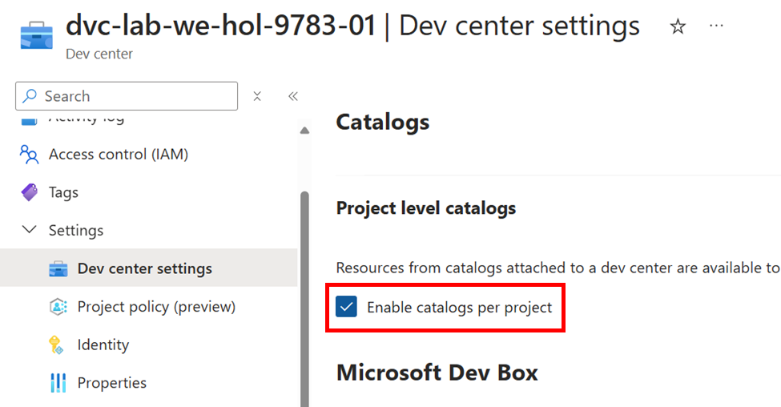

Click on **Apply** and you are ready for the lab!

[az-cli-install]: https://learn.microsoft.com/en-us/cli/azure/install-azure-cli
[az-dev-center-github-pat]: https://learn.microsoft.com/en-us/azure/deployment-environments/how-to-configure-catalog?tabs=GitHubRepoPAT#add-a-catalog
[az-portal]: https://portal.azure.com
[docker-desktop]: https://www.docker.com/products/docker-desktop/
[git-client]: https://git-scm.com/downloads
[github-account]: https://github.com/join
[repo-fork]: https://github.com/microsoft/hands-on-lab-platform-engineering-for-ops/fork
[vs-code]: https://code.visualstudio.com/
[terraform-install]: https://learn.hashicorp.com/tutorials/terraform/install-cli

---

# Lab 1 - Dev Box Management

Dev Center is a platform that allows you to create and manage Dev Boxes for your developers. Dev Boxes are fully managed development environments that can be customized to meet the needs of your developers. You can create Dev Box definitions that define the size and configuration of the Dev Boxes, and then create Dev Box pools that contain the Dev Box definitions. Developers can then create Dev Boxes from the Dev Box pools on demands.

Dev Boxes are VM instances that are created in your Azure subscription and managed behind the scene using Intune. They are fully managed by Microsoft and are automatically updated with the latest security patches and updates. Dev Boxes is designed for developers.  

The goal of this lab is to create a project in the Dev Center that represent the project of your team. Then you will assign Dev Box definitions to it and create Dev Box pools. The developers assigned to the project will then be able to deploy Dev Boxes on demands. You will also see how to enable customizations for the Dev Boxes using catalogs.

This is the architecture that this lab cover:

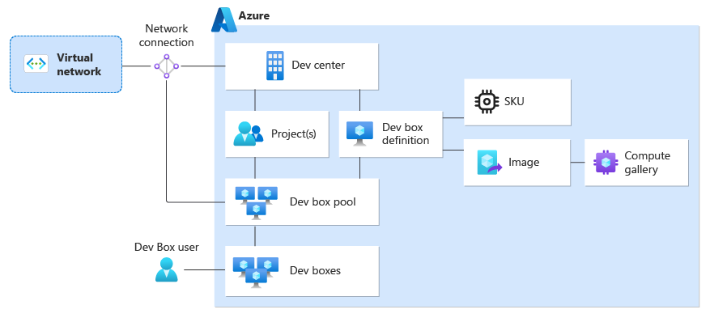

All the lab will be done in the Dev Center resource created. Search for `Dev Center` in your subscription:

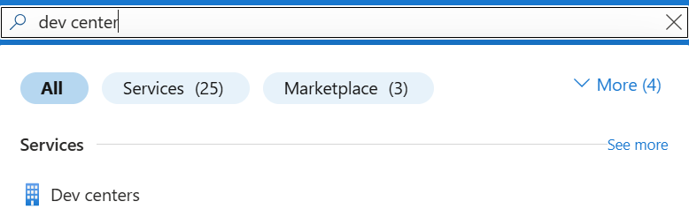

and select the Dev Center created for your with the infra as code.

## Create a Dev Box definition

To reflect a real-world scenario, you will create two Dev Box definitions, one for the frontend and one for the backend. The Dev Box definitions will have different sizes and configurations to meet the needs of the developers working on the frontend and the backend.

<div class="task" data-title="Tasks">

> Create 2 Dev Box definitions, one for the frontend and one for the backend.
>
> The frontend Dev Box definition should have the following configuration:
> - Name: `dev-box-ops-win-11-frontend-<your-initials>`
> - Image: Pick `Visual Studio 2022 Enterprise on Windows 11 Enterprise + Microsoft 365 Apps 23H2 | Hibernate supported`
> - Image version: `Latest`
> - Compute size: `8 vCPUs, 32 GB RAM`
> - Storage: `256 GB SSD`
>
> The backend Dev Box definition should have the following configuration:
> - Name: `dev-box-ops-win-11-backend-<your-initials>`
> - Image: Pick `Visual Studio 2022 Enterprise on Windows 11 Enterprise + Microsoft 365 Apps 23H2 | Hibernate supported`
> - Image version: `Latest`
> - Compute size: `16 vCPUs, 64 GB RAM`
> - Storage: `256 GB SSD`
>
> Enable the Hibernate mode for both Dev Box definitions.

</div>

<div class="tip" data-title="Tips">

> [Dev Box Definition setup][dev-box-definition]<br>

</div>

<details>
<summary>📚 Toggle solution</summary>

To do that, inside the Dev Center, go to **Dev Box Definitions** and select **Create**

Create a new Dev Box definition with the following parameters to represent the frontend Dev Box:

- Name: `dev-box-ops-win-11-frontend-<your-initials>`
- Image: Pick a Visual Studio 2022 image with Windows 11
- Image version: `Latest`
- Compute size: `8 vCPUs, 32 GB RAM`
- Disk size: `256 GiB SSD`

And enable the Hibernate mode. The Hibernation feature is a power-saving state that saves your running applications to your hard disk and then shuts down the virtual machine (VM). When you resume the VM, all your previous work is restored.


Repeat the same steps to create a new Dev Box definition for the backend:

- Name: `dev-box-ops-win-11-backend-<your-initials>`
- Image: Pick a Visual Studio 2022 image with Windows 11
- Image version: `Latest`
- Compute size: `16 vCPUs, 64 GB RAM`
- Disk size: `512 GiB SSD`

You have now created two Dev Box definitions, one for the frontend and one for the backend.

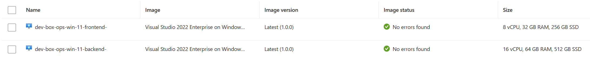

These Dev Boxes definitions are now available at the Dev Center level, the next step is to assign them to a project to be consumed by the developers of this specific project.

</details>

## Create a project

A project in Dev Center represent a group of developers working on a company project. You must assign Dev Box definitions to create Dev Box pools for a project. Developers assigned to the project will be able to create Dev Boxes from the Dev Box pools using the Dev Box portal that you will see later.

<div class="task" data-title="Tasks">

> Create a project in the Dev Center with the following configuration:
> - Name: `prj-ops-<your-initials>`
> - Set the number of Dev Boxes to 5 as a maximum for each developer

</div>

<details>
<summary>📚 Toggle solution</summary>

Inside your Dev Center, go to **Manage** > **Projects** and click on **Create**.


Give a name that start with `prj-ops-<your-initials>` and then add your initials.


In the **Dev Box Management** panel you can directly fix the number of Dev Boxes for this project.

Select **Yes** and set the maximum number of Dev Boxes that can be deployed per each developer to `5`:


Ignore the `Catalogs` part for now.

Click on **Review + Create** and then **Create**.

After a few seconds, the project is created. Open it.

</details>

## Create Dev Box pools for the project

The next step is to give access to the Dev Box definitions in the project. To do this, you need to create Dev Box pools for the project and assign the Dev Box definitions to them.

<div class="task" data-title="Tasks">

> Create 2 Dev Box pools for the project, one for the frontend and one for the backend.
>
> The frontend Dev Box pool should have the following configuration:
> - Name: `dev-box-ops-win-11-frontend`
> - Dev Box definition: `dev-box-ops-win-11-frontend-<your-initials>`
> - Network: `Microsoft Hosted network` in `West Europe`
> - Select `Local Administrator`
> - Auto-stop mode: `Enabled` with your preferred time
>
> The backend Dev Box pool should have the same configuration except the name:
> - Name: `dev-box-ops-win-11-backend`

</div>

<details>
<summary>📚 Toggle solution</summary>

Inside your project, go to **Dev Box Pools** and click on **Create**.

Start with the frontend one, give it the name `dev-box-ops-win-11-frontend`  and select the Dev Box definition you created for the frontend.

For the network part, you can inject a Dev Box into a specific VNet but for this lab, we will keep it simple and use the default Microsoft Hosted network in `West Europe`.

Select `Local Administrator` so the user can have full control over the Dev Box:


To save on costs, you can enable an auto-stop schedule on a dev box pool. Microsoft Dev Box attempts to stop all dev boxes in the pool at the time specified in the schedule. You can configure one stop time in one timezone for each pool.

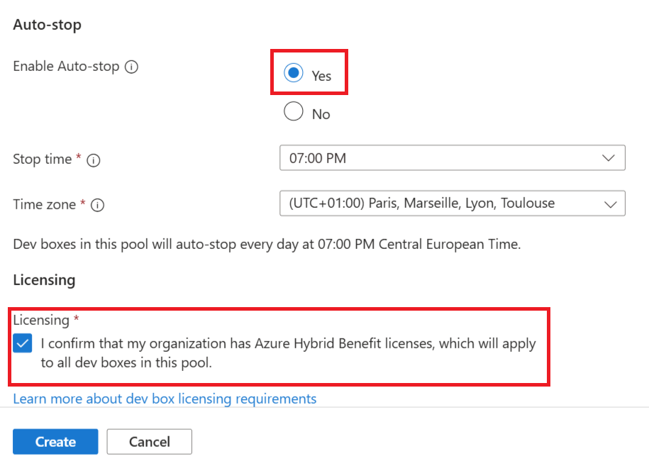

Check the licence agreement and click on **Create**.

Repeat the same steps to create a Dev Box pool for the backend Dev Box definition.

You have now created two Dev Box pools, one for the frontend and one for the backend. The developers assigned to this project will be able to create Dev Boxes from these pools only.

</details>

## Assign an identity to the project

Go to the **Settings** tab and click on **Identity** and add a System Assigned Managed Identity:

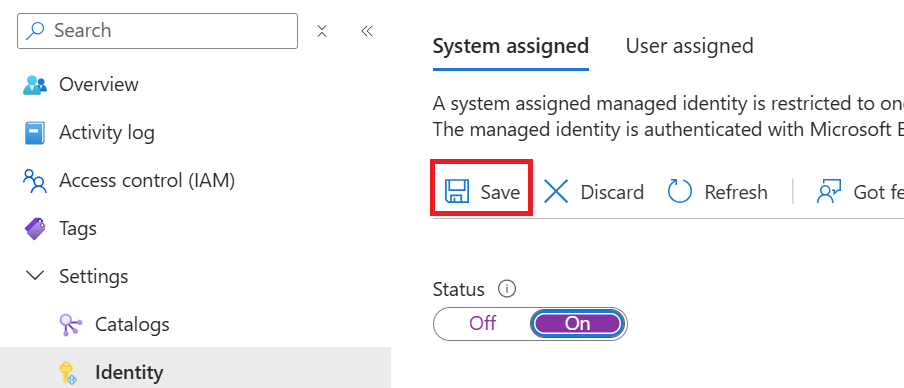

Wait for the identity to be created.

This identity (kind of "service account") will be used for the project to be able to interact with other Azure services such as the Key Vault that you will need later.

Go to the resource group and open the Key Vault. In the **Access policies** tab, add a new access policy for the project identity (`prj-ops-<your-initials>`) with the following permissions:

- **Secret permissions**: `Get` and `List`

Click on **Create**, your project have now the permissions to get and list secrets from the Key Vault.

## Autorized customizations

At this point, you have created a project with Dev Box pools for the frontend and the backend developers. These Dev Box pools provide default configuration for your developers. However, you may want to allow your developers to customize their Dev Boxes to meet their specific needs or to install additional tools. This can be done by authorizing customizations at the project level.

Developers can customize their Dev Boxes using [YAML files](https://en.wikipedia.org/wiki/YAML) such as this one at the instanciation of the Dev Box:

```yaml
# https://github.com/microsoft/devcenter-catalog
# From https://github.com/microsoft/devcenter-examples
# Optionaly declare the devbox image to use 

$schema: 1.0
name: "devbox-customization-example"
tasks:
  - name: choco
    parameters:
      package: vscode

  - name: choco
    parameters:
      package: azd

  - name: git-clone
    description: Clone this repository into C:\Documents
    parameters:
      repositoryUrl: https://github.com/microsoft/dotnet.git
      directory: C:\Documents

# Other possibilities: powershell, winget, install-vs-extension   
```

As you can see, it's composed only of tasks that will be executed at the creation of the Dev Box. Those tasks are not available by default in your DevBox, you need to enable them at the project level.

You can control the different tasks that can be executed on the Dev Box by adding or not their definitions in a catalog.

Official catalogs are available here:

- https://github.com/microsoft/devcenter-catalog in the `Tasks` folder
- https://github.com/microsoft/devcenter-examples in the `advanced-examples` folder

You can pick the tasks you want and put it in your own company repository and then refer it to the project as a catalog or refer these repositories directly.

In our case you already have a folder called `tasks` available in this [Git repository][git-repo] with the following tasks:

- choco
- customization-wsl
- download-ado-artifacts
- git-clone
- install-by-curl
- install-vs-extension
- powershell
- winget

To enable the use of catalog items, go to your project, under **Settings**, select **Catalogs**. 

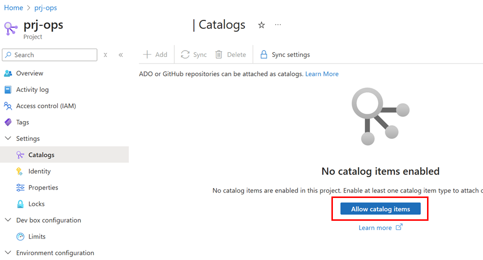

In the **Catalog item settings** pane, select **Azure deployment environment definitions** to enable the use of environment definitions at the project level.

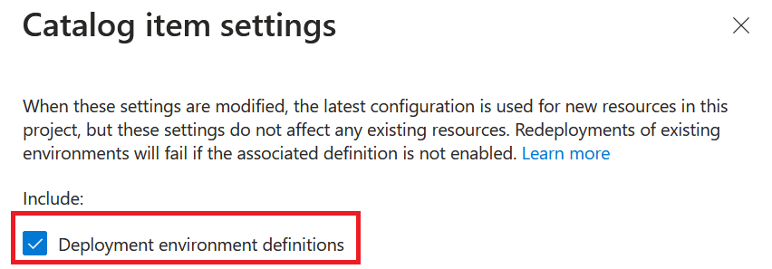

Now, you can add a catalog to the project.

<div class="task" data-title="Tasks">

> - Add the Catalog `/tasks` available in the [Git repository][git-repo] of this lab to the project to enable the use of catalog items at the project definition. Don't forget to add ".git" at the end of the URL (i.e.: https://github.com/microsoft/hands-on-lab-platform-engineering-for-ops.git)
> - Target the `main` branch of the repository.
> - Use the GitHub PAT token secret available in the Key Vault by refering this url with the right name: `https://<YOUR-KEY-VAULT-NAME>.vault.azure.net/secrets/Pat`
> - Give the catalog the name `official-tasks`

</div>

<div class="tip" data-title="Tips">

> [Add a catalog with a GitHub PAT][add-catalog-with-github-pat]<br>

</div>

<details>
<summary>📚 Toggle solution</summary>

Let's add the catalog to the project. Go to the project **Settings** and then **Catalogs** and click on **Add**.

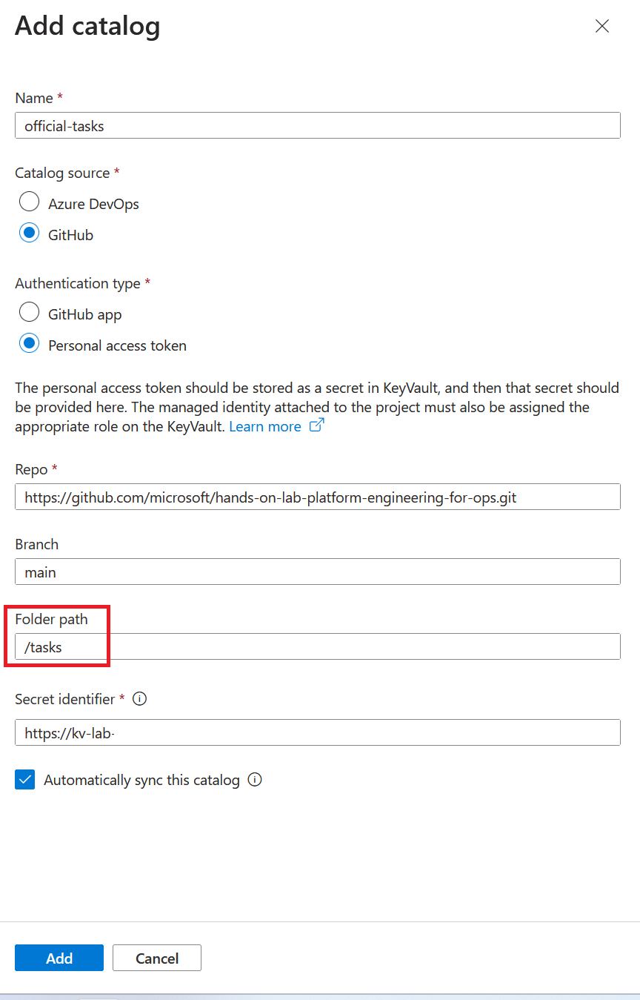

Set the `Repo` url to `https://github.com/microsoft/hands-on-lab-platform-engineering-for-ops.git` and target the `main` branch. 

Notice the `/` before the folder name `tasks` to specify the folder where the tasks are located.

Then go to the resource group to retreive the Key Vault name. This will be used to retreive the secrets from the Key Vault. The Pat is located at this location:

```bash
https://<YOUR-KEY-VAULT-NAME>.vault.azure.net/secrets/Pat
```

Click on **Add** and you should see the catalog added to the project with a status of `Sync Successful`.

Now, the developers assigned to this project will be able to use the tasks defined in the catalog to customize their Dev Boxes.

</details>

## Act as a Developer

To see the Dev Box in action, you can act as a developer assigned to the project.

In your project go to **Access control (IAM)** and add the role `DevCenter Dev Box User` to your self at the project level.

Go to the [Dev Box Portal][dev-box-portal] and sign in, you should see a button to create a new Dev Box and be able to pass a YAML file to customize your Dev Box similar to the one we saw previously.


For that, create a YAML file locally on your computer and past this content:

```yaml
# https://github.com/microsoft/devcenter-catalog
# From https://github.com/microsoft/devcenter-examples
# Optionaly declare the devbox image to use 

$schema: 1.0
name: "devbox-customization-example"
tasks:
  - name: choco
    parameters:
      package: vscode

  - name: choco
    parameters:
      package: azd

  - name: git-clone
    description: Clone this repository into C:\Documents
    parameters:
      repositoryUrl: https://github.com/microsoft/dotnet.git
      directory: C:\Documents

# Other possibilities: powershell, winget, install-vs-extension   
```

Then use it to create a DevBox by enabling **customizations**. 

<div class="tip" data-title="Tips">

The creation of the DevBox can take a lot of time, but you can continue the lab during the creation

</div>

## Act as a project administrator

Once a developer has created a Dev Box, you can see the total number of Dev Boxes created per definitions in the **Manage** > **Dev box pools** section.

[add-catalog-with-github-pat]: https://learn.microsoft.com/en-us/azure/deployment-environments/how-to-configure-catalog?tabs=GitHubRepoPAT#add-your-repository-as-a-catalog
[dev-box-definition]: https://learn.microsoft.com/en-us/azure/dev-box/how-to-manage-dev-box-definitions
[dev-box-portal]: https://devbox.microsoft.com/
[git-repo]: https://github.com/microsoft/hands-on-lab-platform-engineering-for-ops

---

# Lab 2 - Manage deployment environments

Dev Center also allows you to create and manage `deployment environments` for your projects. This feature is named Azure Deployment Environment service. 

Deployment environments are fully managed environments that can be customized to meet the needs of your developers based on Infra As Code (ARM, Bicep, Terraform, Pulumi). Developers can then deploy pre packaged environments in a safe and controlled way using the best practice of your company.

This is the architecture that this lab cover:

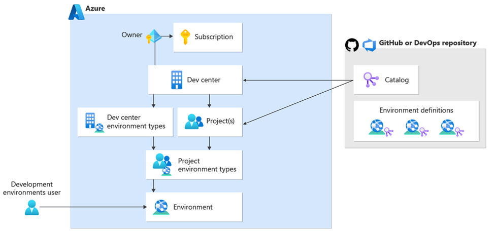

## Add an environment to the project

Go back to your Dev Center, in the **Environment Configuration** and then **Environment Type** section, you will see that 3 environments are already available: `dev`, `test`, and `prod`. Each environment can be linked to a specific subscription but for this lab, you will use the same subscription for all the environments.

Those environments are the only ones available for all the projects linked to the Dev Center. Each project can refer to one or more of these environments. You can give different permissions to the developers to each environment for each project.

In fact, you can imagine scenarios where developers will have more rights in the `dev` environment than in the `prod` environment.

<div class="task" data-title="Tasks">

> Link the 3 environments available in the Dev Center to your project.
> Set the following permissions to your developers for each environment:
> - In `dev` environment the `Owner` role
> - In `test` environment the `Contributor` role
> - In `prod` environment the `Reader` role

</div>

<details>
<summary>📚 Toggle solution</summary>

In your project, go to **Environment Configuration** and then **Environment Type**. In this section you will link the environments available in the Dev Center to the project. 

Click on **Add**, you will be redirected to a form where you can select the environment you want to link to the project.

So for each environment, select the role you want to give to your developers and click on **Add**.

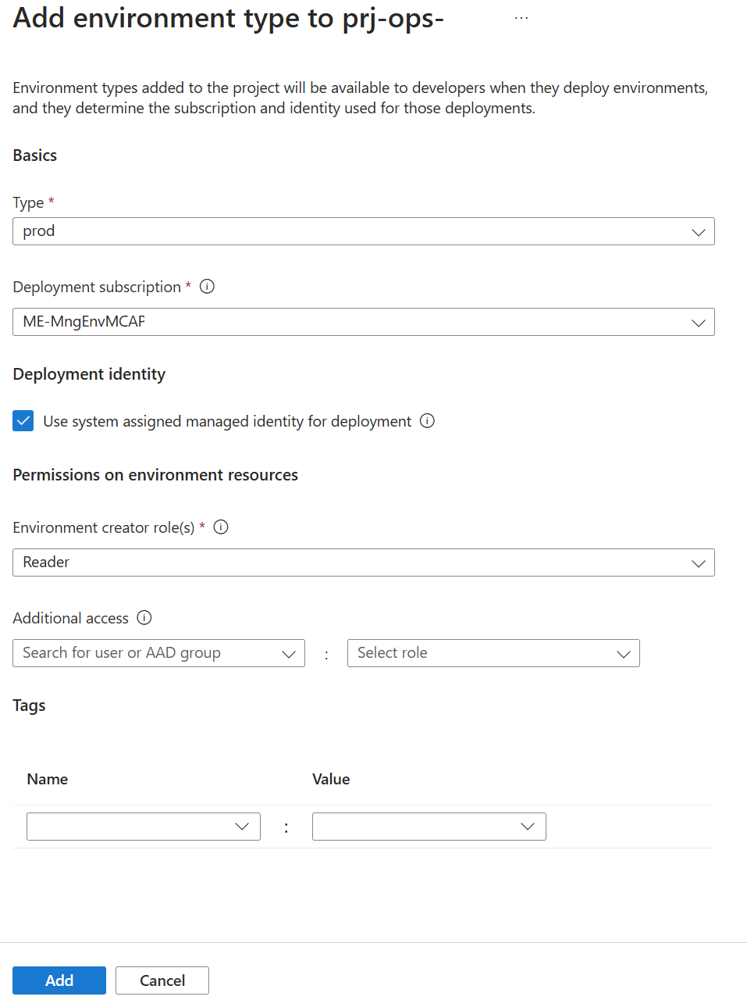

If everything is ok, you should see the 3 environments linked to the project in the **Environment Type** section:

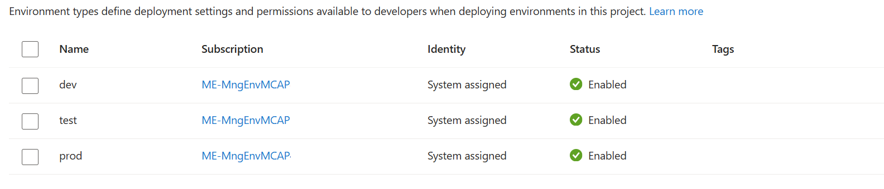

</details>

## Add environment catalog

As you saw in the previous lab, you can add a catalog to a project to allow developers to customize their Dev Boxes.

However, catalogs can also be used to define the Azure environments that will be available in the project. These catalogs of Azure resources are created by the ops team to give the developers team the appropriate area to deploy their application in compliance with the company rules.

The developers will be able to create environments using the same [portal][dev-box-portal] as they used for Dev Boxes.

To define an environment for a catalog you need to create a YAML file that will define the environment configuration and associate this file with an Infra As Code template.

The templates that you will use for this lab are located in the `environments` folder of this [repository][git-repo].

As you can see, you have 2 folders:
- `WebApp` to create a Web App environment (made using ARM)
- `ContainerApp` to create your Container App (made using Bicep)

Inside each folder you have:
- an `environment.yaml` file that defines the environment configuration
- an `azuredeploy.json` file that defines the ARM template to deploy the environment or a `main.bicep` file if you prefer to use Bicep

You can also use Terraform and Pulumi to define your environments. Of course, you can create as much as infra as code files as you want to define your environment, you will just need to follow official conventions to have the right name for the entry point file.

More examples are available in this [official catalog templates][ade-official-catalog]

<div class="task" data-title="Tasks">

> - Add the `environments` folder from this [repository][git-repo] as a catalog to your project.
> - Use the `main` branch of the repository.
> - Use the GitHub PAT token secret available in the Key Vault by refering this url with the right name: 
> `https://<YOUR-KEY-VAULT-NAME>.vault.azure.net/secrets/Pat`
> - Give the catalog the name `official-environments`

</div>

<details>
<summary>📚 Toggle solution</summary>

To add the catalog to the project, go to the project **Settings** and then **Catalogs** and click on **Add**.


Set the `Repo` url to `https://github.com/microsoft/hands-on-lab-platform-engineering-for-ops.git` and target the `main` branch. 

Notice the `/` before the folder name `environments`, this is important to specify the folder where the different Infra As Code templates are located.

Then go to the resource group to retreive the Key Vault name. Like previously, this will be used to retreive the secrets from the Key Vault. The Pat is located at this location:

```bash
https://<YOUR-KEY-VAULT-NAME>.vault.azure.net/secrets/Pat
```

Click on **Add** and you should see the catalog added to the project with a status of `Sync Successful`.

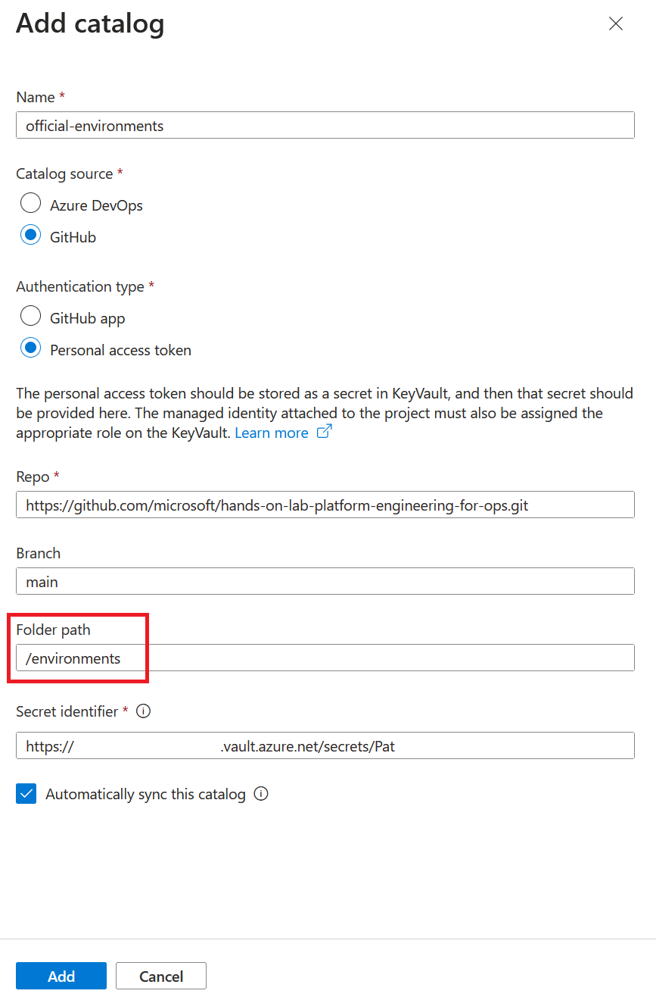

You now have a catalog of environments available in your project. Developers assigned to this project will be able to create environments using the templates defined in this catalog.
</details>

## Create a catalog 

Let's imagine that you want to create your own catalog of environments. This is a basic use case, if you have a specific environment configuration which reflect exactly one of your project.

Let's do this by providing an APIM environment using Bicep.

<div class="task" data-title="Tasks">

> - Create your own catalog. In your own GitHub account, create a new **Public** repository and inside it a `CustomEnvironments` folder create an `Apim` folder
> - Add an `environment.yaml` file to define only the name of the APIM as a parameter
> - Add a `main.bicep` file to define the APIM deployment using Bicep and choose Consumption Tier
> - Add the catalog to the project in the same way you did for the previous catalogs.

</div>

<details>
<summary>📚 Toggle solution</summary>

In your own GitHub account, create a new repository **Public** and in a `CustomEnvironments` folder create an `Apim` folder the following files:

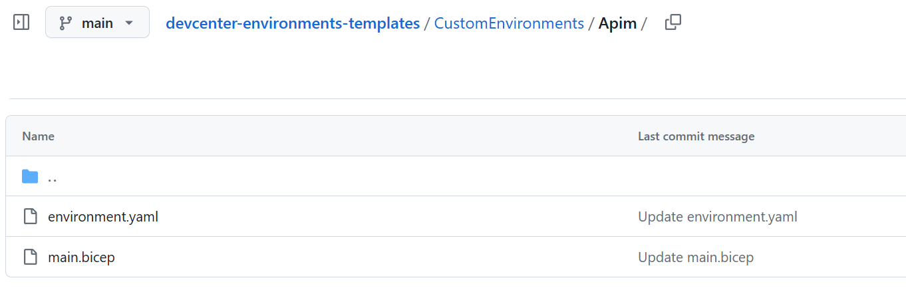

The `environment.yaml` contains the following:

```yaml
name: APIM
summary: This is an APIM deployment using Bicep.
description: Deploys an APIM using the Consumption Sku.
templatePath: main.bicep
parameters:
- id: name
  name: Name
  description: 'Name of the Apim'
  type: string
  required: true
runner: Bicep
```

And the `main.bicep` file contains the following:

```bicep
@description('The name of the API Management service instance')
param name string = ''

var resourceName = !empty(name) ? replace(name, ' ', '-') : 'apim'

@description('Location for all resources.')
param location string = resourceGroup().location

resource apiManagementService 'Microsoft.ApiManagement/service@2023-05-01-preview' = {
  name:  'resourceName${uniqueString(resourceGroup().id)}'
  location: location
  sku: {
    name: 'Consumption'
    capacity: 0
  }
  properties: {
    publisherEmail: 'company@company.me'
    publisherName: 'Company'
  }
}
```

Of course the deployment can be more complex, with multiple bicep files and modules but let's keep it simple for this lab.

Now, you can add this catalog to the project in the same way you did for the previous catalog:

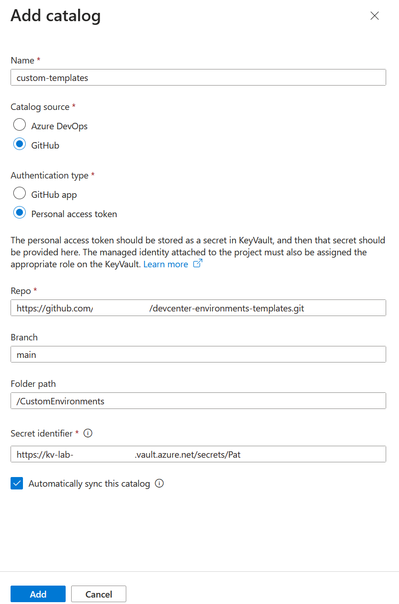

If you need to update the catalog, you can do it by updating the files in the repository and then click on **Sync** in the catalog settings of the project.

Finally you should see your 3 catalogs:


</details>

## Act as a Developer

Let's act as a developer to try to create an environment using the catalog you just added. 

Add the role `Deployment Environments User` to your self  at the project level. It can takes few minutes to apply.

Go to the [Dev Box Portal][dev-box-portal] and sign in.

You should see a drop down button to create a new environment:


You can select the environment you want to create and pass the parameters needed for the deployment. After the deployment is done you can see the resources deployed by just clicking in the **Environment resources** link.

The developers can use the Dev Box portal to deploy their environment but if they prefer they can use [Azure Developer CLI][azd-link] (azd) which is just one config file to add to their project to be able to deploy the environment using the CLI.

## Act as a project administrator

Let's act as an ops to see the deployment environments created by the developers.

Add the role `DevCenter Project Admin` to your self at the project level.

In the Azure Portal, in your project go to **Manage** and then **Environments**. You should see the environments created by the developers:

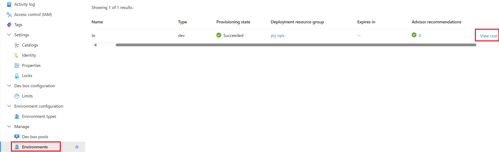

You can see the associated cost for each deployment using the `View Cost` tab and potential advisor recommendations. As an Ops this will help you to control the cost of the deployments and to update your Infra As Code templates based on the security recommendations.

[ade-official-catalog]: https://github.com/Azure/deployment-environments
[dev-box-portal]: https://devbox.microsoft.com/
[git-repo]: https://github.com/microsoft/hands-on-lab-platform-engineering-for-ops
[azd-link]: https://learn.microsoft.com/en-us/azure/developer/azure-developer-cli/

---

# Lab 3 - Governance with Azure Policy

## Introduction

In this lab, you will explore Azure Policy, a service in Azure that you use to create, assign and manage policies. These policies enforce different rules and effects over your resources, so those resources stay compliant with your corporate standards and service level agreements.

There are few key concepts to understand before you start with the lab:

- The first object to create when working with Azure Policies, is a **Policy Definition**. It expresses what to evaluate and what action to take. For example, you could have a policy definition that restricts the regions available for resources.

- Some **Policy Definitions** are built-in and you can also create custom policies. The built-in policies are provided by Azure, and you can't modify them. Custom policies are created by you, and you can define the conditions under which they are enforced.

- Once you have a policy definition, you can assign it to a specific scope. The scope of a **Policy Assignment** can be a management group, a subscription, a resource group, or a resource. When you assign a policy, it starts to evaluate resources in the scope. Of course, you can exclude specific child scopes from the evaluation.

- When a policy is assigned, it's enforced. If a resource is not compliant with the policy, the policy's defined effect is applied. The effect could be to deny the request, audit the request, append a field to the request, or deploy a resource.

- In some cases, you might want to exempt a resource from a policy assignment. You can do this by creating a **Policy Exemption**. An exemption is a way to exclude a specific resource from a policy's evaluation. 

In the Azure Portal, there are dedicated resource groups for each participant based on the participant number.

In your resource group, you will find:

- A virtual network
- An Azure Resource Manager template spec that deploys a network security group with few inbound rules. (you can ignore it for now)

Azure Policy has many effects, but in this lab you will focus on the 3 main effects that can be applied to resources: 
- Deny
- Modify
- DeployIfNotExists

Each effect has a different impact on the resources that are evaluated against the policy.

<div class="task" data-title="Tasks">

> - For each effect, you'll be deploying a Policy Definition and assign on your dedicated resource groups (or sub resources).
> - You will then follow the instructions and manipulate your dedicated resources to trigger the policy effect (whether it is a deny, modify, or a deployIfNotExists).
> - You will then check the compliance status of your resources.
> - Finally, you will change the default parameters to see how the policies change their behavior.

</div>

## Getting started with the Deny effect

Let's start by crafting a new policy that denies the creation of network security group rules that allow inbound traffic from public IP addresses into the virtual network. The policy will take as a parameter a list of allowed IP ranges in case you need to allow some specific IP addresses (like CDN IPs or Proxy IPs).

### Discover the policy definition
<details>
<summary>📚 Here is the new Policy definition to deploy</summary>

```json
{
  "displayName": "CD-DenyPubInbound-NSG",
  "description": "This policy denies any inbound NSG rules that allows traffic from public addresses that are not in the list of allowed IPs.",
  "policyType": "Custom",
  "mode": "All",
  "parameters": {
    "listOfAllowedIps": {
      "type": "Array",
      "metadata": {
        "displayName": "List of Allowed inbound sources IP ranges",
        "description": "List of Allowed inbound sources IP ranges"
      },
      "defaultValue": [
        "10.0.0.0/8",
        "172.16.0.0/12",
        "192.168.0.0/16"
      ]
    }
  },
  "policyRule": {
    "if": {
      "anyOf": [
        {
          "allOf": [
            {
              "field": "type",
              "equals": "Microsoft.Network/networkSecurityGroups"
            },
            {
              "count": {
                "field": "Microsoft.Network/networkSecurityGroups/securityRules[*]",
                "where": {
                  "allOf": [
                    {
                      "field": "Microsoft.Network/networkSecurityGroups/securityRules[*].access",
                      "equals": "Allow"
                    },
                    {
                      "field": "Microsoft.Network/networkSecurityGroups/securityRules[*].direction",
                      "equals": "Inbound"
                    },
                    {
                      "anyOf": [
                        {
                          "field": "Microsoft.Network/networkSecurityGroups/securityRules[*].sourceAddressPrefix",
                          "equals": "*"
                        },
                        {
                          "field": "Microsoft.Network/networkSecurityGroups/securityRules[*].sourceAddressPrefix",
                          "equals": "Internet"
                        },
                        {
                          "count": {
                            "value": "[parameters('listOfAllowedIps')]",
                            "name": "allowedIps",
                            "where": {
                              "value": "[ ipRangeContains( current('allowedIps'), if ( and(not(empty(current('Microsoft.Network/networkSecurityGroups/securityRules[*].sourceAddressPrefix'))), contains(current('Microsoft.Network/networkSecurityGroups/securityRules[*].sourceAddressPrefix'), '.'))  , current('Microsoft.Network/networkSecurityGroups/securityRules[*].sourceAddressPrefix'), current('allowedIps') ) )]",
                              "equals": true
                            }
                          },
                          "equals": 0
                        },
                        {
                          "count": {
                            "field": "Microsoft.Network/networkSecurityGroups/securityRules[*].sourceAddressPrefixes[*]",
                            "where": {
                              "count": {
                                "value": "[parameters('listOfAllowedIps')]",
                                "name": "allowedIps",
                                "where": {
                                  "value": "[ ipRangeContains( current('allowedIps'), if ( contains(current('Microsoft.Network/networkSecurityGroups/securityRules[*].sourceAddressPrefixes[*]'), '.'), current('Microsoft.Network/networkSecurityGroups/securityRules[*].sourceAddressPrefixes[*]'), current('allowedIps') ) ) ]",
                                  "equals": true
                                }
                              },
                              "equals": 0
                            }
                          },
                          "notEquals": 0
                        }
                      ]
                    }
                  ]
                }
              },
              "notEquals": 0
            }
          ]
        },
        {
          "allOf": [
            {
              "field": "type",
              "equals": "Microsoft.Network/networkSecurityGroups/securityRules"
            },
            {
              "field": "Microsoft.Network/networkSecurityGroups/securityRules/access",
              "equals": "Allow"
            },
            {
              "field": "Microsoft.Network/networkSecurityGroups/securityRules/direction",
              "equals": "Inbound"
            },
            {
              "anyOf": [
                {
                  "field": "Microsoft.Network/networkSecurityGroups/securityRules/sourceAddressPrefix",
                  "equals": "*"
                },
                {
                  "field": "Microsoft.Network/networkSecurityGroups/securityRules/sourceAddressPrefix",
                  "equals": "Internet"
                },
                {
                  "count": {
                    "value": "[parameters('listOfAllowedIps')]",
                    "name": "allowedIps",
                    "where": {
                      "value": "[ ipRangeContains( current('allowedIps'), if ( and(not(empty(field('Microsoft.Network/networkSecurityGroups/securityRules/sourceAddressPrefix'))), contains(field('Microsoft.Network/networkSecurityGroups/securityRules/sourceAddressPrefix'), '.'))  , field('Microsoft.Network/networkSecurityGroups/securityRules/sourceAddressPrefix'), current('allowedIps') ) )]",
                      "equals": true
                    }
                  },
                  "equals": 0
                },
                {
                  "count": {
                    "field": "Microsoft.Network/networkSecurityGroups/securityRules/sourceAddressPrefixes[*]",
                    "where": {
                      "count": {
                        "value": "[parameters('listOfAllowedIps')]",
                        "name": "allowedIps",
                        "where": {
                          "value": "[ ipRangeContains( current('allowedIps'), if ( contains(current('Microsoft.Network/networkSecurityGroups/securityRules/sourceAddressPrefixes[*]'), '.'), current('Microsoft.Network/networkSecurityGroups/securityRules/sourceAddressPrefixes[*]'), current('allowedIps') ) ) ]",
                          "equals": true
                        }
                      },
                      "equals": 0
                    }
                  },
                  "notEquals": 0
                }
              ]
            }
          ]
        }
      ]
    },
    "then": {
      "effect": "deny"
    }
  }
}

```

</details>

**Understanding the policy:**

- The provided policy definition's purpose is to deny any inbound Network Security Group (NSG) rules that allow traffic from public addresses not in a predefined list of allowed IPs.

- The policy is of type `Custom` and operates in `All` mode. It has a parameter `listOfAllowedIps` which is an array. The default values for this array are `10.0.0.0/8`, `172.16.0.0/12`, and `192.168.0.0/24`. These are IP ranges in private network address spaces.

- The policy rule is defined under `policyRule`. It uses a conditional `if` statement that checks for multiple conditions using `anyOf` and `allOf` operators. The conditions check the type of the resource, the access type, the direction of the rule, and the source address prefix. If any of these conditions are met, the policy effect is set to `deny`, which means the policy will block the creation or modification of the NSG rule.

- The first set of conditions specifically look for an NSG (`Microsoft.Network/networkSecurityGroups`) that contains at least 1 non-compliant rule. The second set of conditions look for a unitary NSG rule (`Microsoft.Network/networkSecurityGroups/securityRules`) that have `Allow` access and `Inbound` direction. It also checks if the source address prefix is `*` (which means all addresses), `Internet`, or not in the list of allowed IPs. 

- The policy uses the `ipRangeContains` function to check if the source address prefix is within the allowed IP ranges. If the source address prefix is not in the allowed IP ranges, the policy will deny the NSG rule. 

- This policy is useful for ensuring that only specific IP ranges can access resources in your Azure environment, enhancing the security of your network.

### Deploy the policy definition

In the Azure Portal, type **Policy** in the top search bar.
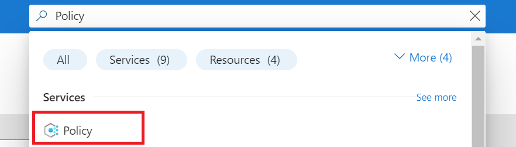

Then click on **Definitions** and then **+ Policy definition**.
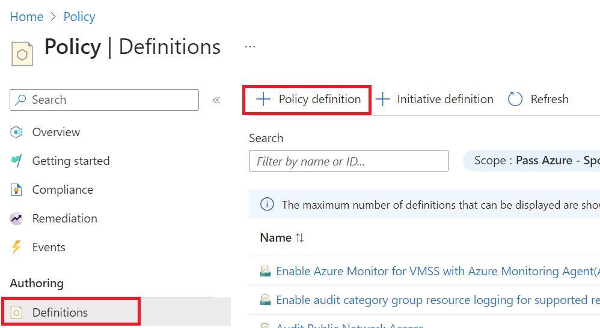

In the **Definition location** select the **Subscription** where you want to deploy the policy definition. Give the policy definition a name like `CD-Deny-MS-NSG-<your-initials>`. Copy the policy definition presented previously and paste it in the **POLICY RULE** pane and click on **Save**.

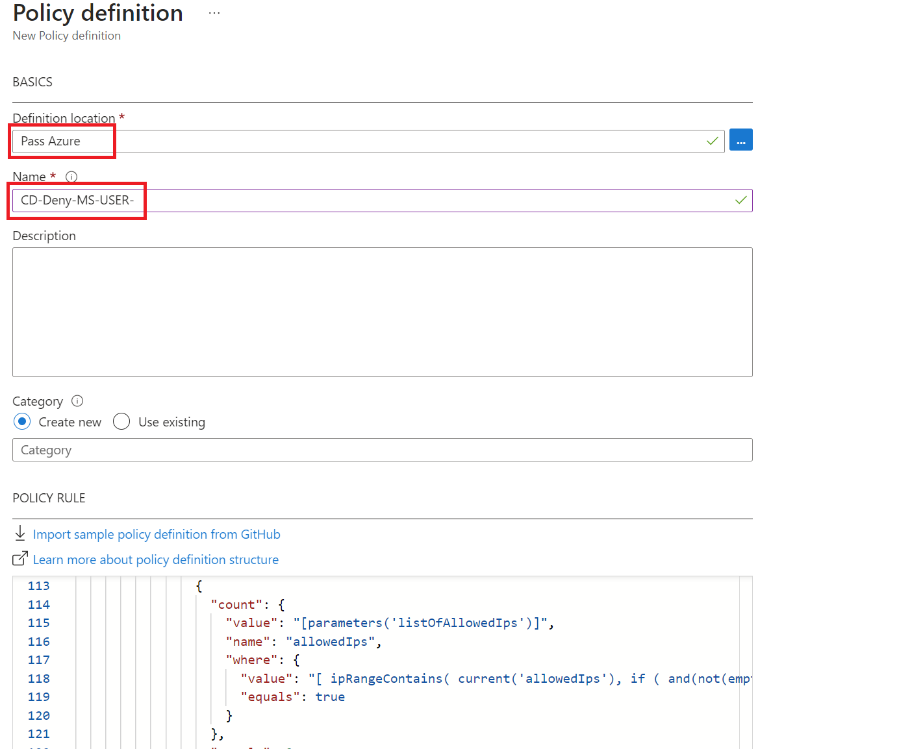

</details>

### Assign the policy

Your Azure Policy is now created globally in your subscription. You need to assign it to a specific scope to start enforcing it.

In your policy, click on **Assign policy**:
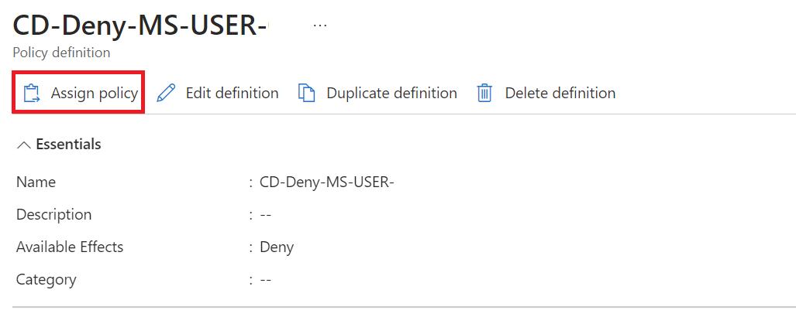

You will be redirected to a new page, where you can assign the policy to a specific scope. In this case, select the resource group that contains the network security group of the resource group assigned to you for this lab.

<div class="warning" data-title="Warning">

> Be sure to select the scope with YOUR resource group

</div>

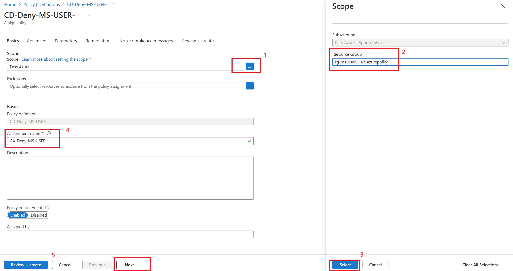

Click on **Next** button and leave the default values of the **Advanced** tab as is.

Then in the **Parameters** tab uncheck **Only show parameters that need input or review** to see the default values of the policy parameter. We are going to leave the default values here for now.
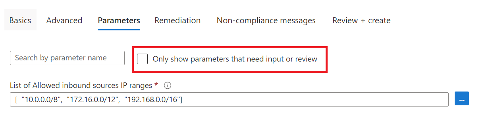

Finally, skip the next steps and click on **Review + create** and then **Create** to assign the policy.

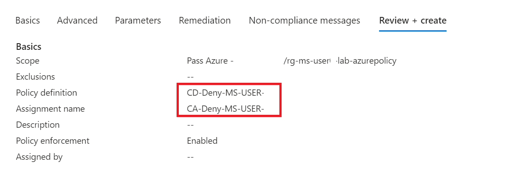

### Test the policy

<div class="task" data-title="Tasks">

> - Try to test your policy on the network security group of your resource group. Try to add a new inbound rule that allows traffic from a public IP address that is not in the list of allowed IPs. You should see an error message that the operation is denied by the policy.
>
> - Use the template spec in your resource group to deploy a network security group.

</div>

<details>
<summary>📚 Toggle solution</summary>

In your resource group, navigate to the template spec and click on the **Deploy** button to deploy a network security group with few default inbound rules that are compliant. 

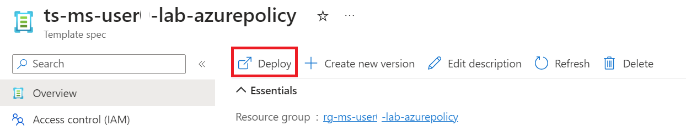

Leave the default parameters and click on **Review + Create**:

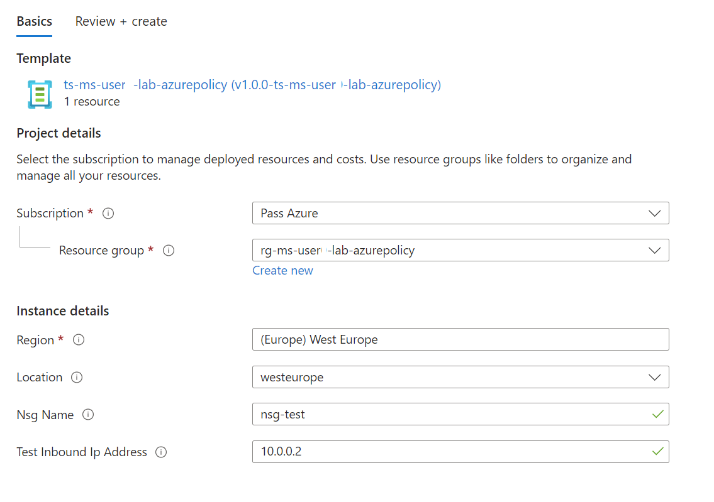

After the deployment is done, navigate to the network security group and try to add a new **inbound security rule** that allows traffic from a public IP address that is not in the list of allowed IPs.

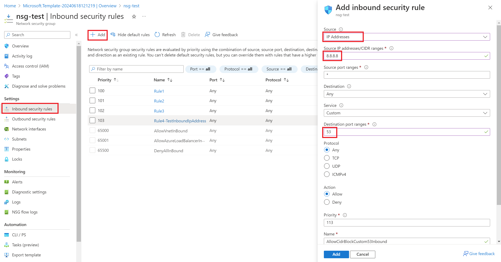

You should see an error message that the operation is denied by the policy:

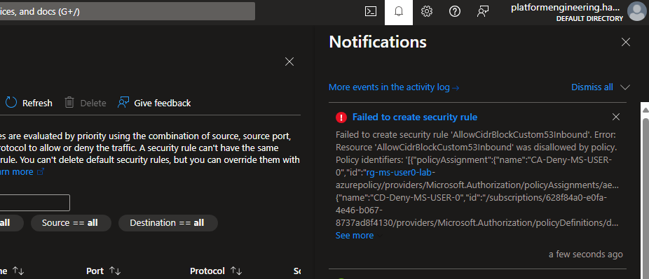

</details>

<div class="tip" data-title="Tips">

> - If the policy error message seems unclear, you can set a human-readable non-compliance message in the policy assignment. This message will be displayed to the user when the policy denies the operation. To do so, you can go to **Policy** > **Assignments** > Select the assignment > **Edit assignment** > **Non-compliance message**.
>
> 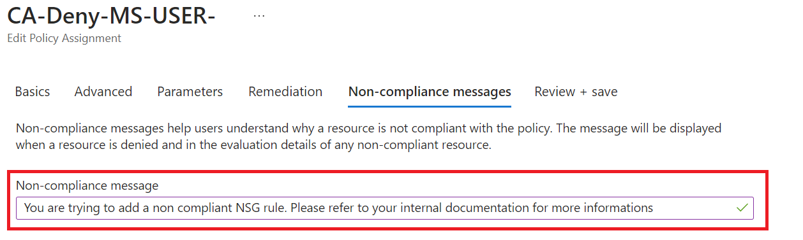
>
> - Try again to add a rule that is non-compliant, and see if the error message is more explicit. You should be having something like this:
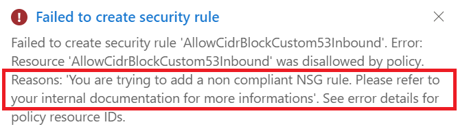
> - Keep playing around with the policy and try to understand the conditions that trigger the deny effect.
</div>

## Enforce rules on-the-fly with the Modify effect

The modify effect is a powerful effect that allows you to modify the properties of a resource to bring it into compliance with the policy.

The policies of **modify** effect intercept any operation on the resource and apply the changes to the resource before the operation is completed. This effect is useful for enforcing configurations on resources in real time. This means any operation that doesn't comply with the policy will be modified to comply with the policy.

Let's create a policy that modifies the tags of a resource group. The policy will add a tag to the resource group if it doesn't already exist.

### Discover the policy definition 

<details>
<summary>📚 Open the Policy definition to deploy</summary>

```json
{
  "displayName": "CD-AddImmuTags-RG",
  "policyType": "Custom",
  "mode": "All",
  "description": "Add immutable tags to resource groups",
  "parameters": {
    "ImmutableTagName": {
      "type": "String",
      "metadata": {
        "displayName": "Immutable Tag Name",
        "description": "Immutable Tag Name"
      },
      "defaultValue": "Environment"
    },
    "ImmutableTagValue": {
      "type": "String",
      "metadata": {
        "displayName": "Immutable Tag Value",
        "description": "Immutable Tag Value"
      },
      "defaultValue": "NonProduction"
    }
  },
  "policyRule": {
    "if": {
      "allOf": [
        {
          "field": "type",
          "equals": "Microsoft.Resources/subscriptions/resourceGroups"
        },
        {
          "field": "[concat('tags[', parameters('ImmutableTagName'), ']')]",
          "notEquals": "[parameters('ImmutableTagValue')]"
        }
      ]
    },
    "then": {
      "effect": "modify",
      "details": {
        "roleDefinitionIds": [
          "/providers/Microsoft.Authorization/roleDefinitions/b24988ac-6180-42a0-ab88-20f7382dd24c"
        ],
        "operations": [
          {
            "operation": "addOrReplace",
            "field": "[concat('tags[', parameters('ImmutableTagName'), ']')]",
            "value": "[parameters('ImmutableTagValue')]"
          }
        ]
      }
    }
  }
}
```
</details>

- The provided policy definition's purpose is to add an immutable tag to a resource group if it doesn't already exist. The policy is of type `Custom` and operates in `All` mode. It has two parameters: `ImmutableTagName` and `ImmutableTagValue`. The default values for these parameters are `Environment` and `NonProduction` respectively.

- Whenever a resource group is **created** or **modified**, the policy checks if the tag with the name specified in `ImmutableTagName` has the value specified in `ImmutableTagValue`. If the tag doesn't exist or has a different value, the policy will modify the resource group by adding or replacing the tag with the specified value.

### Assign & Deploy the policy definition

<div class="task" data-title="Tasks">

> Like you did for the previous policy, deploy and assign the **modify** policy definition to your dedicated resource group. Call it `CD-Modify-MS-RG-<your-initials>`.
> - Try to change the default values of the parameters to see how the policy behaves.
> - Respect the naming convention for the policy definition and the policy assignment, by including your initials to the names.
> - When assigning the policy, beware to **select your dedicated resource group**

</div>

<details>
<summary>📚 Toggle solution</summary

After deploying the policy and assigned it correctly, try to apply a remediation task on your resource group as part of the assignment to enforce the tag like this:
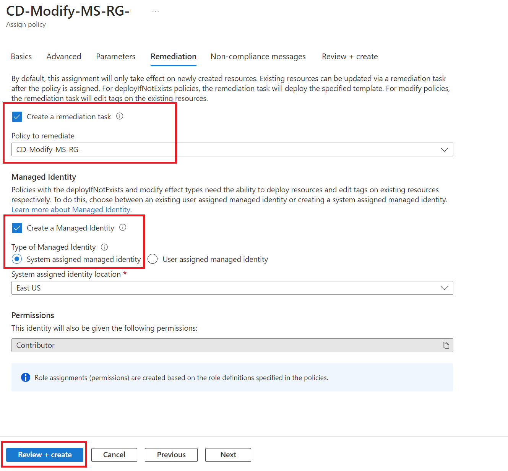

As you can see a **System Managed Identity** is used to apply the remediation task. This identity is used to modify the resource group (to write the tags).

The remediation can take few minutes, to see it, go to **Policy** on Azure, then select **Remediation** tab and select as scope the resource group you assigned the policy to. After a few minutes you should see the remediation task evaluated and then completed.

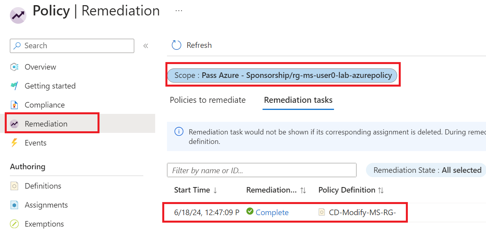

Once the remediation complete you can verify that the tag has been added to the resource group by just navigating to the overview blade of the resource group.
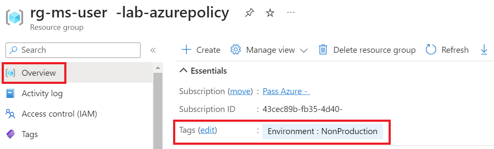

Finally, you can verify in the activity log that the managed identity of the policy assignment was used to modify the resource group:
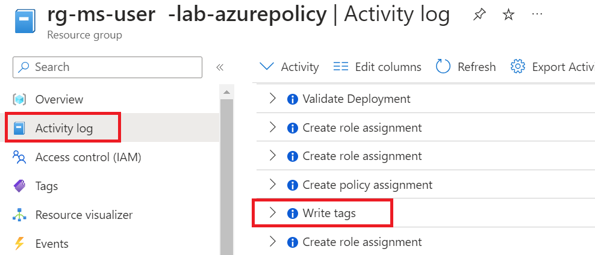

</details>

### Test the policy

In you resource group, navigate to the tags blade of the resource group and check if the tag has been added.

It generally takes **few minutes** for the policy to be applied. If the tag is not added, wait a few more minutes and check again. You can continue to the next section and go back here later.

When the tag appears on the resource group, try to modify its value and see if the policy restores the default value.

Try to delete the tag and see if the policy adds it back.

<div class="tip" data-title="Tips">

> - Every time you modify the tag, refresh the portal to see the changes.
> - If the remediation task takes too long to apply, you can trigger the **modify** policy by adding any random tag. The policy should append the expected tag to the resource group.

</div>

## Extend resources with the DeployIfNotExists effect

### Discover the policy definition of deployIfNotExists

<details>
<summary> 📚 Open the Policy definition to deploy </summary>

```json
{
  "displayName": "CD-VnetLinkZone-Dns",
  "policyType": "Custom",
  "mode": "All",
  "description": "This policy definition creates a virtual network link to a private DNS zone.",
  "parameters": {
    "privateDnsZoneName": {
      "type": "String",
      "metadata": {
        "displayName": "Private DNS Zone Name",
        "description": "Name pattern of the private DNS Zone to link to the hub VNET."
      },
      "defaultValue": "*.westeurope.azurecontainerapps.io"
    },
    "hubVnetResourceId": {
      "type": "String",
      "metadata": {
        "displayName": "Hub virtual network ID",
        "description": "The resource ID of the hub virtual network to which link the private DNS zone",
        "strongType": "Microsoft.Network/virtualNetworks",
        "assignPermissions": true
      }
    }
  },
  "policyRule": {
    "if": {
      "allOf": [
        {
          "field": "type",
          "equals": "Microsoft.Network/privateDnsZones"
        },
        {
          "field": "name",
          "like": "[parameters('privateDnsZoneName')]"
        }
      ]
    },
    "then": {
      "effect": "deployIfNotExists",
      "details": {
        "type": "Microsoft.Network/privateDnsZones/virtualNetworkLinks",
        "existenceCondition": {
          "field": "Microsoft.Network/privateDnsZones/virtualNetworkLinks/virtualNetwork.id",
          "equals": "[parameters('hubVnetResourceId')]"
        },
        "name": "[concat(field('name'), '/link-to-hub-set-by-policy')]",
        "roleDefinitionIds": [
          "/providers/Microsoft.Authorization/roleDefinitions/b24988ac-6180-42a0-ab88-20f7382dd24c"
        ],
        "deployment": {
          "properties": {
            "mode": "incremental",
            "template": {
              "$schema": "https://schema.management.azure.com/schemas/2019-04-01/deploymentTemplate.json#",
              "contentVersion": "1.0.0.0",
              "parameters": {
                "linkName": {
                  "type": "string"
                },
                "virtualNetworkId": {
                  "type": "string"
                }
              },
              "resources": [
                {
                  "name": "[parameters('linkName')]",
                  "type": "Microsoft.Network/privateDnsZones/virtualNetworkLinks",
                  "apiVersion": "2018-09-01",
                  "location": "global",
                  "properties": {
                    "registrationEnabled": false,
                    "virtualNetwork": {
                      "id": "[parameters('virtualNetworkId')]"
                    }
                  }
                }
              ]
            },
            "parameters": {
              "linkName": {
                "value": "[concat(field('name'), '/link-to-hub-set-by-policy')]"
              },
              "virtualNetworkId": {
                "value": "[parameters('hubVnetResourceId')]"
              }
            }
          }
        }
      }
    }
  },
  "versions": [
    "1.0.0"
  ]
}
```
</details>

- The provided policy definition's purpose is to create a virtual network link to a private DNS zone if it doesn't already exist. The policy is of type `Custom` and operates in `All` mode. It has two parameters: `privateDnsZoneName` and `hubVnetResourceId`. The default value for `privateDnsZoneName` is `*.westeurope.azurecontainerapps.io`.

- The virtual network link of a private DNS zone is created only if the private DNS zone name matches the pattern specified in `privateDnsZoneName`. The policy checks if the virtual network link already exists by comparing the virtual network ID with the value specified in `hubVnetResourceId`. If the virtual network link doesn't exist, the policy will deploy the virtual network link to the private DNS zone.

- This policy is super userful for ensuring automated links between certain Private DNS Zones to specific virtual network to enable DNS resolution with other virtual networks.

### Assign & Deploy the policy definition

<div class="task" data-title="Tasks">

> - Like you did for the previous policy, deploy and assign the **DeployIfNotExists** policy definition to your dedicated resource group. Call it `CD-DeployIfNotExists-MS-RG-<your-initials>`.
> - Try to change the default values of the parameters to see how the policy behaves. You may want to have your own private DNS zone pattern pattern.
> - When assigning the policy, beware to select your dedicated resource group
> - When assigning the policy, beware to select your dedicated virtual network as a **hubVnetResourceId** parameter.
>
> 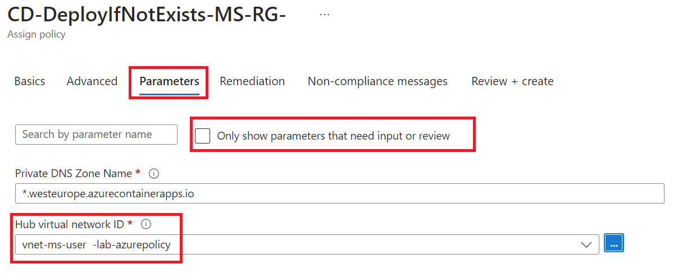

</div>

### Test the policy

In your resource group, create a new private DNS zone that matches the pattern specified in the policy definition. With this format: `user<your-initials>.westeurope.azurecontainerapps.io`.
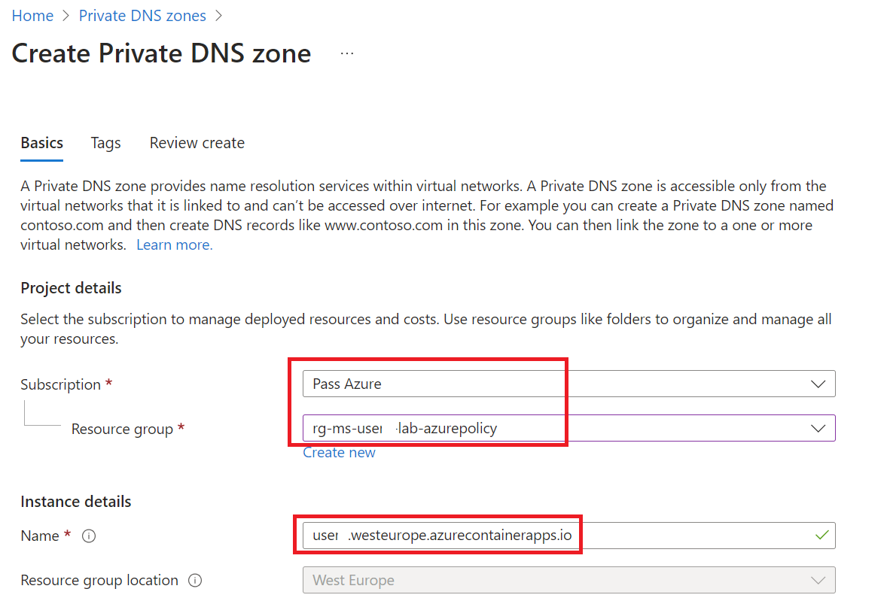

Check if the virtual network link is created automatically. This can take a few minutes to be applied.
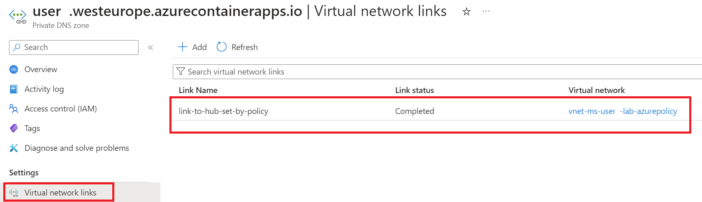

Verify the activity logs to see the deployment of the virtual network link:
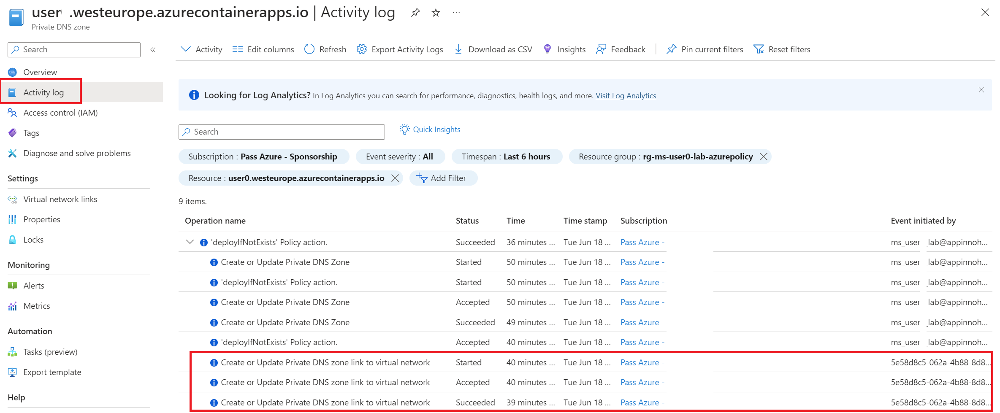

As you can see in the **Event initiated by**, the identity used to deploy the virtual network link is the System Managed Identity of the policy assignment that you created before.

## Understand Exemptions

### Exempt a resource

Let's discover how to exempt a resource from a policy assignment. In this challenge, you will exempt a network security group from the policy assignment that denies inbound rules from public IP addresses.

Using the deployment template spec in your resource group, create a new network security group in your resource group:

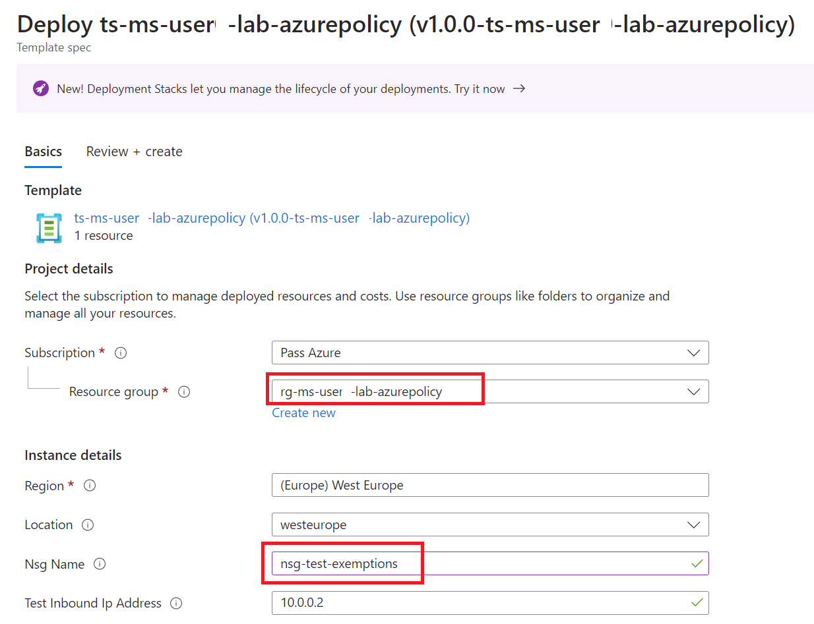

The new network security group should appear alongside the previous one.

Now you will exempt the new network security group from the policy assignment that denies inbound rules from public IP addresses. Go to **Policy** > **Assignments** > Select your **`CA-Deny-MS-User-<your-initials>`** assignment, and click on **Create Exemption**.

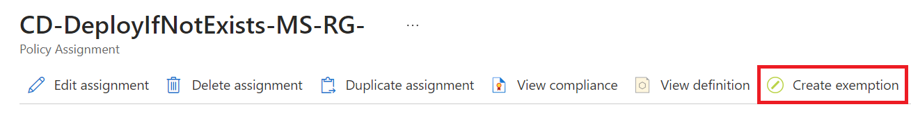

Select **nsg-test-exemption** as the scope of the exemption and then click on **Review + Create**.

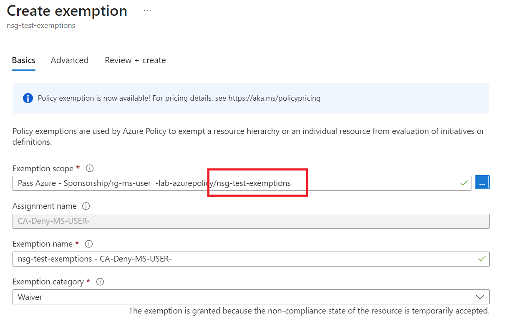

### Test the exemption

Go to the network security group that you exempted from the policy assignment and try to add a non-compliant **inbound security rule**:

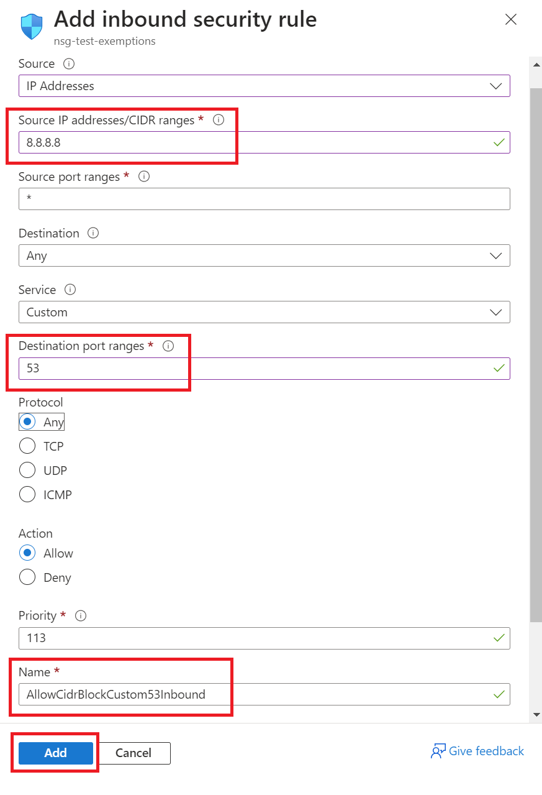

You should see that the operation is not denied by the policy, and the rule is created successfully:
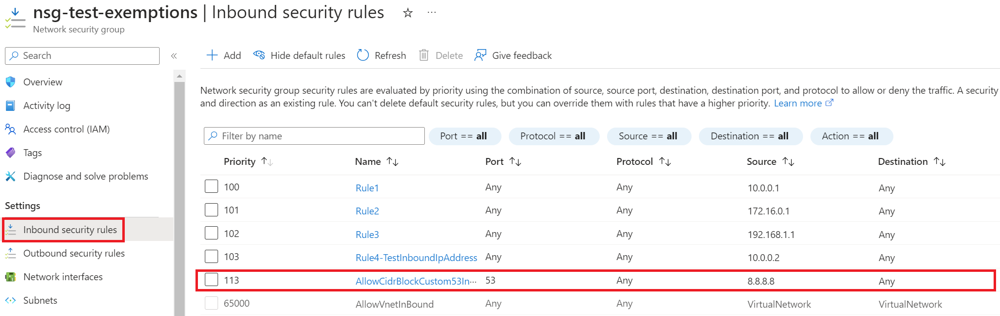

Meanwhile, go back to the first network security group you created, if you try to add a non-compliant rule, you still get an error message.

<div class="warning" data-title="Warning">

> It is important to note that when creating an exemption for a resource, it is generally discouraged to exempt everything. By exempting the policy assignment in the previous challenge, you have allowed all source address prefixes, which is not ideal in real-life scenarios.
>
> In practice, cybersecurity teams typically exempt specific patterns rather than granting full access. Therefore, you need to protect the new NSG against unallowed patterns by enforcing a new policy assignment on the exempted NSG and that includes the new rule pattern in the default parameter.
>
> Let's assume that the cyber team has only allowed 8.8.8.8 as a valid source address. You can add this address to the default parameter of the policy assignment and then test the exemption again.
> - **OUTCOME: The new NSG should only allow inbound rules with 8.8.8.8 as a source but denies everything else (just like the other NSG)**

</div>

## Reading the compliance report

At the end of this workshop take a time to read the compliance report of your resources. You can find the compliance report in the **Policy** blade of the Azure Portal.

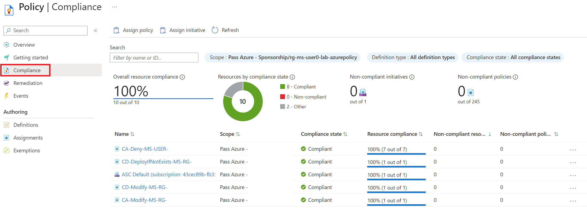

Azure Policy compliance data could be used to trigger automations that can remediate non-compliant resources. You can also use the compliance data to generate reports and monitor the security and compliance posture of your resources.

---

# Lab 4: Use GitHub Advanced Security

In this lab you will discover how GitHub Advanced Security (GHAS) can improve the security in your repositories without slowing development of your teams.

You will cover 3 main pilars:

- Dependabot
- Code scanning
- Secret scanning

**Dependabot** serves as an automated dependency management tool, ensuring that project dependencies remain current. It actively monitors libraries and frameworks utilized in a project, automatically creating pull requests to update dependencies to their most recent secure versions. By addressing vulnerabilities in outdated dependencies, Dependabot contributes to maintaining a secure and stable development environment.

**Code scanning** plays a crucial role in GitHub Advanced Security, examining source code for security vulnerabilities and coding mistakes. It utilizes static analysis methods to detect potential issues like SQL injection, cross-site scripting, and buffer overflows. By delivering automated feedback directly in the pull request workflow, code scanning empowers developers to tackle vulnerabilities early in the development lifecycle.

**Secret scanning** detects and mitigates inadvertent exposure of sensitive information like API keys and tokens within source code. By searching for predefined patterns and signatures associated with sensitive data, secret scanning promptly addresses potential security risks. It defaults to accurate patterns provided by a GitHub Partner, but custom patterns can be created for specific use cases. Notably, secret scanning includes push protection, which proactively prevents secret leaks during code commits, and provides an easy way to view and remediate alerts directly within GitHub.

Let's try these features!

<div class="task" data-title="Tasks">

> - Create a GitHub **public** repository in your own GitHub Account.

</div>

All the features that you will see in this lab can be control globally in a GitHub Enterprise Organisation.

## Dependabot

Let's activate Dependabot in your repository, go to **Settings** > **Code security** and enable **Dependabot alerts** and **Dependabot security updates**:


<div class="task" data-title="Tasks">

> - Simulate a node project by adding 2 files to your repository directly on the `main` branch:

</div>

<details>
<summary>📄 package.json </summary>

```json
{
    "name": "ghas_demo",
    "version": "1.0.0",
    "description": "demo project",
    "license": "MIT",
    "scripts": {
        "start": "node main.js"
    },
    "dependencies": {
        "axios": "0.21.1",
        "minimist": "1.2.5"
    }
}
```
</details>

<details>
<summary>📄 package-lock.json </summary>

```json
{
    "name": "ghas_demo",
    "version": "1.0.0",
    "lockfileVersion": 3,
    "requires": true,
    "packages": {
        "": {
            "name": "ghas_demo",
            "version": "1.0.0",
            "license": "MIT",
            "dependencies": {
                "axios": "0.21.1",
                "minimist": "1.2.5"
            }
        },
        "node_modules/axios": {
            "version": "0.21.1",
            "resolved": "https://registry.npmjs.org/axios/-/axios-0.21.1.tgz",
            "integrity": "sha512-dKQiRHxGD9PPRIUNIWvZhPTPpl1rf/OxTYKsqKUDjBwYylTvV7SjSHJb9ratfyzM6wCdLCOYLzs73qpg5c4iGA==",
            "dependencies": {
                "follow-redirects": "^1.10.0"
            }
        },
        "node_modules/follow-redirects": {
            "version": "1.15.6",
            "resolved": "https://registry.npmjs.org/follow-redirects/-/follow-redirects-1.15.6.tgz",
            "integrity": "sha512-wWN62YITEaOpSK584EZXJafH1AGpO8RVgElfkuXbTOrPX4fIfOyEpW/CsiNd8JdYrAoOvafRTOEnvsO++qCqFA==",
            "funding": [
                {
                    "type": "individual",
                    "url": "https://github.com/sponsors/RubenVerborgh"
                }
            ],
            "engines": {
                "node": ">=4.0"
            },
            "peerDependenciesMeta": {
                "debug": {
                    "optional": true
                }
            }
        },
        "node_modules/minimist": {
            "version": "1.2.5",
            "resolved": "https://registry.npmjs.org/minimist/-/minimist-1.2.5.tgz",
            "integrity": "sha512-FM9nNUYrRBAELZQT3xeZQ7fmMOBg6nWNmJKTcgsJeaLstP/UODVpGsr5OhXhhXg6f+qtJ8uiZ+PUxkDWcgIXLw=="
        }
    }
}
```
</details>

If you go to the **Insights** tab and then **Dependency graph** you should see the details of all depencies of your project and also alerts or warning if some of them are not up to date:

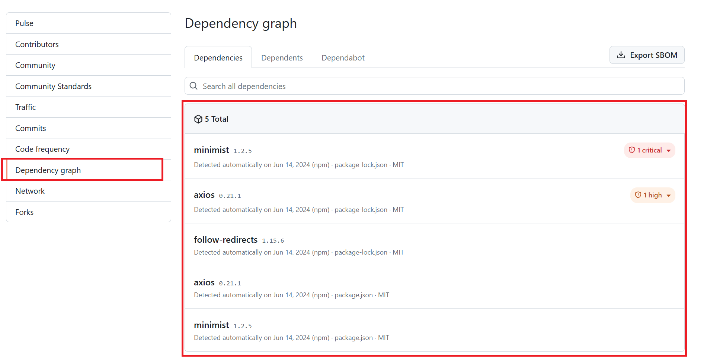

As you can see two packages `minimist` and `axios` are not up to date and present risks.

In parallel, if you go to the **Security** tab in the **Dependabot** section you can see that 3 alerts regarding those outdated packages has been raised. Most importantly, after a few seconds `Dependabot alert` has already detected the issues and suggested a Pull Request to fix those issues:


Dependabot alerts inform you when your code depends on a package that is insecure. These Dependabot alerts reference the [GitHub Advisory Database][github-advisory-db]. This list of known security vulnerabilities and malware group two categories: **GitHub reviewed advisories** and **unreviewed advisories**.

For each alert `Dependabot security updates` has beed used to give you more details on the alert:


Then you can click on the **Review security update** which will redirect you to the associated Pull Request.

<div class="task" data-title="Tasks">

> - Validate one of the Pull Requests 
> - The number of security issues should decrease automatically

</div>

Did you see the number of alerts decreasing after you approved the Pull Request and that GitHub fixed the issue for you ?

Now let's activate another feature called `Dependabot version updates`.

First, add a new file called `sandbox-workflow.yaml` inside the `.github/workflows` with the content provided below. You have to create the folders first of course.

<details>
<summary>📄sandbox-workflow.yaml</summary>

```yaml
name: Sandbox
on:
  workflow_dispatch:
  
jobs:
  get_current_step:
    runs-on: ubuntu-latest
    steps:
      - name: Checkout
        uses: actions/checkout@v3

      - name: Hello
        run: echo Hello World
```

</details>

As you probably already noticed, the action `actions/checkout` is outdated and should have a version greater than 3, let's see how `Dependabot version updates` can help you on that.

Navigate to the **Settings** tab and select **Code security** and enable **Dependabot version updates**.
You will be redirected to a YAML editor to define a file called `dependabot.yml`. This file allows you to configure dependabot to check dependencies of your different package manager and dynamically create Pull Requests to update them.

<div class="task" data-title="Tasks">

> - Define a daily check on github actions packages
> - Define a weekly check on npm packages

</div>

<div class="tip" data-title="Tips">

> [Dependabot YAML Configuration][dependabot-yaml-configuration]<br>

</div>

<details>
<summary>📚 Toggle solution</summary>

In a file called `dependabot.yml` inside the `.github` folder define the 2 rules:

```yaml
version: 2
updates:
 - package-ecosystem: "github-actions"
   directory: "/"
   schedule:
     interval: "daily"
 - package-ecosystem: "npm"
   directory: "/"
   schedule:
     interval: "weekly"
```

Commit this file and after a few minutes you should see a new Pull Request automatically created to suggest the update to the latest version of the `actions/checkout`.

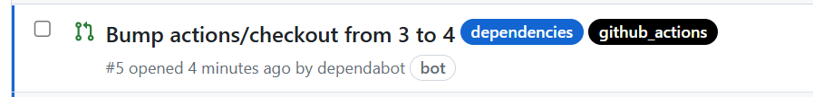

You can then review the changes and accept the Pull Request.

</details>

In this first section you have learned how to:

- View and use dependency graph.
- Enable and use Dependabot alerts.
- Enable and use Dependabot security updates.
- Enable and use Dependabot version updates.

## Code scanning

### Activate Code Scanning

Code scanning is a feature of GitHub Advanced Security that helps you find and fix security vulnerabilities in your code. It scans your code as well as your pull requests are created and alerts you about any vulnerabilities found.

Let's create an empty file called `main.js` in your repository. Just add some code in it such as

```js
console.log("hello")
```

To enable code scanning, go to the **Settings** tab and select **Code security**, then go to **Code scanning** inside and select **Set up** and **Default**.


In the **Languages to analyze** you should have `JavaScript/TypeScript` selected.

In the **Query suites** CodeQL [queries][code-ql-query] are packaged in bundles called "suites". This section allows you to choose which query suite to use.  Leave it set as **Default** for this exercise.

The **Scan events** section defines when CodeQL should scan. In this case, it's set to scan on any pull request to the `main` branch.

Click on **Enable CodeQL** and wait for the setup to be completed.

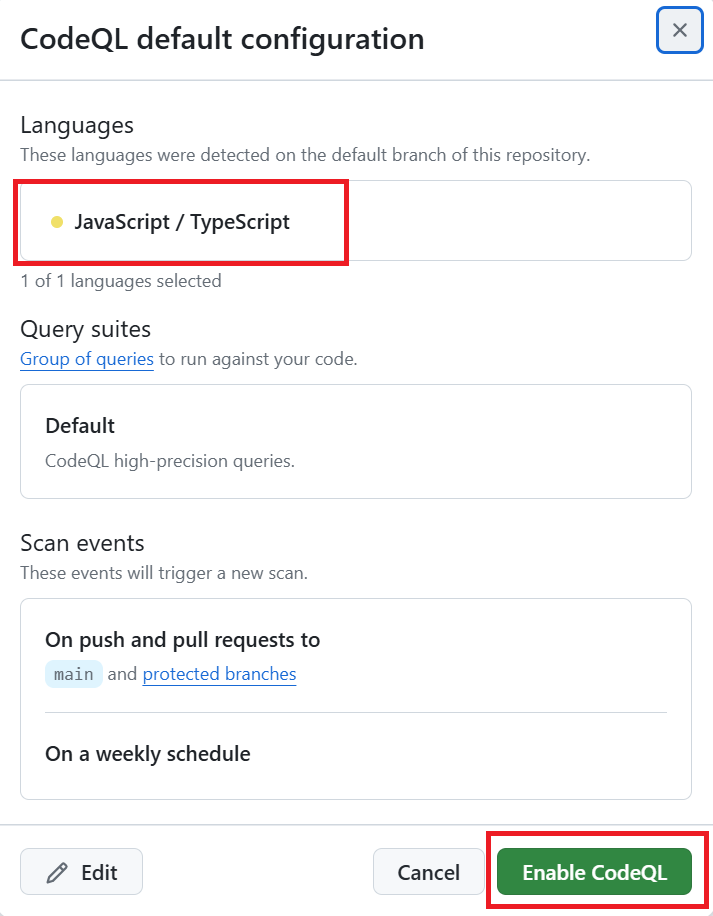

You can see the status of the setup in the **CodeQL Setup** workflow in the **Action** tab:

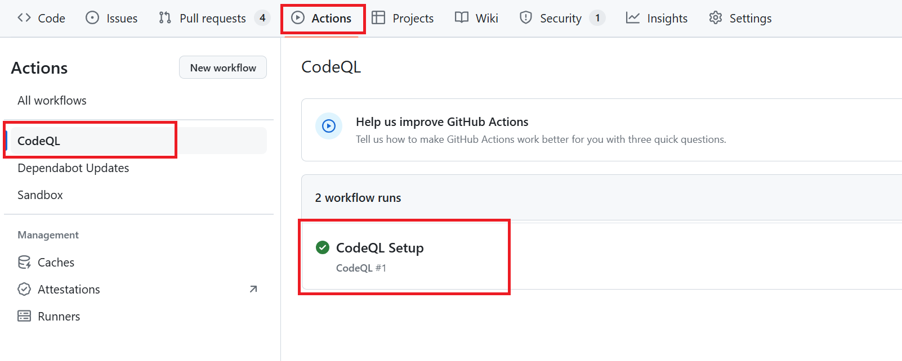

### Detect a vulnerability

Now let's add some code to the `main.js` file directly on `main` branch to raise a vulnerability:

```js
var app = require('express')();

app.get('/user/:id', function(req, res) {
	let id = req.params.id;
	id = id.replace(/<|>/g, ""); // BAD
	let userHtml = `<div data-id="${id}">${getUserName(id) || "Unknown name"}</div>`;
	// ...
	res.send(prefix + userHtml + suffix);
});
```

Go back to the **Actions** tab and you should see a new workflow called `CodeQL` running. This workflow is responsible for scanning the code and raising alerts. 

At the end of the execution of this workflow, you will see a new alert raised inside the **Security** panel of your repository, in the **code scanning** section.


Select it to see the details of the vulnerability raised:

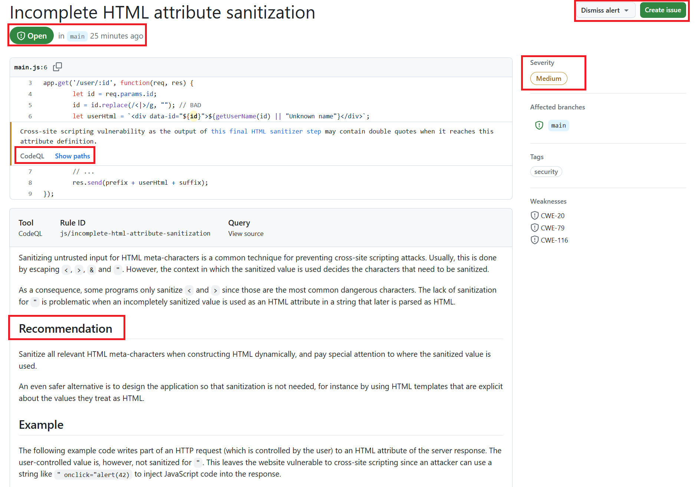

You can see different important informations:

- **Alert status:** This section displays the current alert status (open or closed), identifies the affected branch and shows the timestamp of the alert.

- **Paths:** Clicking on "Show paths" will give you additional insights regarding the flow of data through your application. 

- **Recommendations:** If you click on **Show more**, you will see more details and examples on how to resolve this issue, as well as links to additional resources.

- **Additional info:** Finally, the right-side panel contains information such as tags, [CWE][cwe-official-documentation] information, and the severity of the alert.

On the right side of the alert, you can directly create an issue based on it, to track the resolution of the vulnerability. Also, you can dismiss the alert if you think it's a false positive.

### Pull Request Analysis

Edit the `main.js` file to add the following code and create a new Pull Request (There is no link between this code and the previous one, it's just for the purpose of this lab):

```js
const app = require("express")(),
      pg = require("pg"),
      pool = new pg.Pool(config);

app.get("search", function handler(req, res) {
  // BAD: the category might have SQL special characters in it
  var query1 =
    "SELECT ITEM,PRICE FROM PRODUCT WHERE ITEM_CATEGORY='" +
    req.params.category +
    "' ORDER BY PRICE";
  pool.query(query1, [], function(err, results) {
    // process results
  });
});
```

Click **Commit changes...** from the top right. The "Propose changes" window will pop up.
Select the radio button next to **Create a new branch**. You can create a new name for this branch or leave it as the default suggestion.
Click **Propose changes**, this opens a new pull request, finally click **Create pull request**.

The CodeQL workflow will run again directly on the Pull Request:

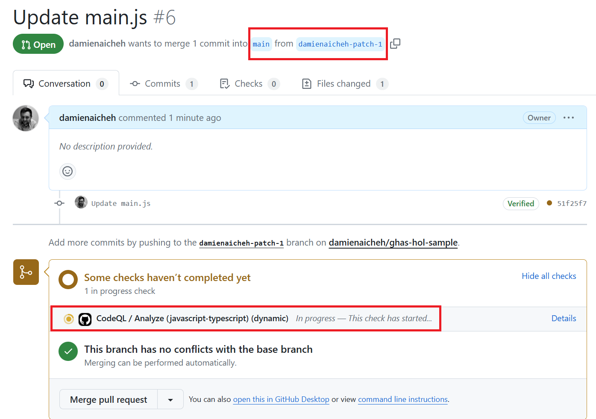

After a few minutes you should see a new alerts raised by a GitHub Action Workflow which analyse the new code and directly update the Pull Request with comments like this one:


The vulnerability raised is a Database query built from user-controlled sources which can lead to SQL Injection. More informations about this vulnerability is available [here][codeql-sql-injection]

As you can see, Code Scanning is a powerful tool to detect vulnerabilities in your code but also to raise alerts directly in the Pull Request to help developers to fix them before the code is going to production.

## Secret scanning

Secret scanning is a feature of GitHub Advanced Security that scans repositories for known secret formats and immediately notifies repository admins when secrets are found.

Secret scanning is enabled by default for all public repositories.

The main feature regarding secret scanning is the ability to block the push of a commit if a secret is found in the code.

Let's create a file called `secrets.yaml` in your repository with the following content.

<div class="warning" data-title="Warning">

> Do not forget to remove the `<REMOVEME>` block in the content.

</div>

```yaml
default:
  github-token: github_pat_<REMOVEME>11A4YXR6Y0v36CYFkuT5I1_ZRWX91c8k0waSN6x7AiVJ6zZ9ZHUQXBblBqFQpKd23V6CL7MWMPopnmBxzn
  output: json
  region: us-east-2
```

This file contains a fake GitHub PAT token that should be detected by the secret scanning. When you will try to push this file to the repository, the push will be blocked and you should see a message like this one:


Select **It's used for tests** and commit the changes.

If you go to the **Security** tab, you should see the alert raised by the secret scanning:


<div class="warning" data-title="Warning">

> When you work in a local environment or a GitHub Codespace, secret scanning cannot block your commit but  your push to GitHub will be blocked. In this case, if the secret is active then you will need to remove the secret from your branch and commit history or revoke it.

</div>

You can find all the patterns available for secret scanning in the official [documentation][github-secret-scanning-patterns-available].

[codeql-sql-injection]: https://codeql.github.com/codeql-query-help/javascript/js-sql-injection/
[code-ql-query]:https://docs.github.com/en/code-security/code-scanning/automatically-scanning-your-code-for-vulnerabilities-and-errors/about-code-scanning-with-codeql#about-codeql-queries
[cwe-official-documentation]: https://cwe.mitre.org/
[dependabot-yaml-configuration]: https://docs.github.com/en/code-security/dependabot/dependabot-version-updates/configuration-options-for-the-dependabot.yml-file
[github-advisory-db]: https://github.com/advisories
[github-secret-scanning-patterns-available]:https://docs.github.com/en/code-security/secret-scanning/secret-scanning-patterns

---

# Closing the workshop

Once you're done with this lab you can delete the resource group you created at the beginning.

To do so, click on `delete resource group` in the Azure Portal to delete all the resources and audio content at once. The following Az-Cli command can also be used to delete the resource group :

```bash
# Delete the resource group with all the resources
az group delete --name <resource-group>
```

Also, for security purpose, remove the unused GitHub PAT token in your GitHub account.
