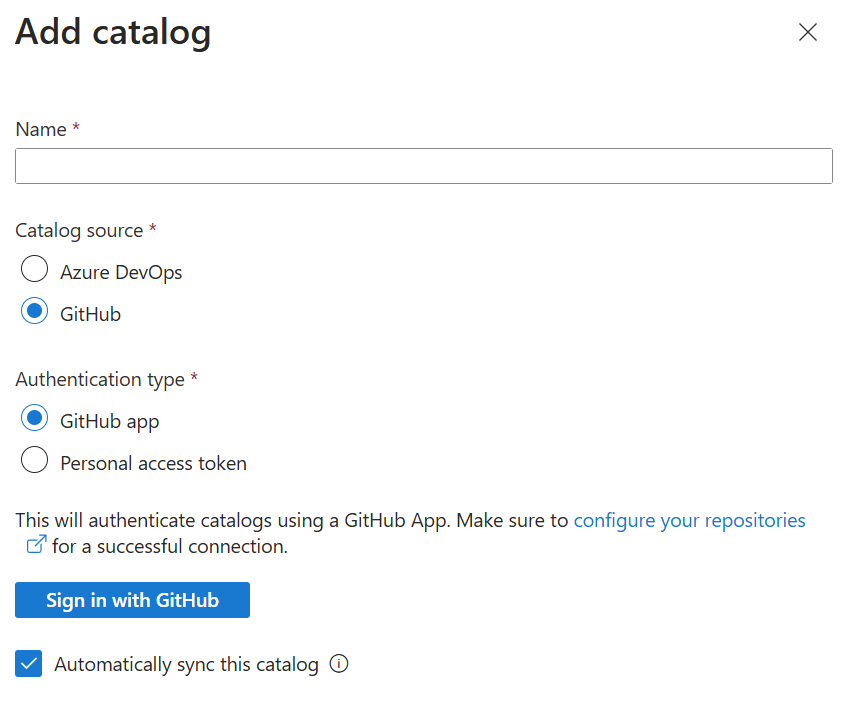

# Product Hands-on Lab - Platform engineering for Ops


## Prerequisites

GitHub Account

Activate "Enable Catalog per projects"


## Lab 1


Inside the Dev Center, go to **Dev Box Definitions** and select **Create**

Create a new Dev Box definition with the following parameters:

- Name: `dev-box-ops-win-11-frontend-<your-initials>`
- Image: Pick a Visual Studio 2022 image with Windows 11
- Image version: `Latest`
- Compute size: `8 vCPUs, 32 GB RAM`
- Disk size: `256 GiB SSD`

And enable Hibernate mode, this will...


Repeat the same steps to create a new Dev Box definition for the backend:

- Name: `dev-box-ops-win-11-backend-<your-initials>`
- Image: Pick a Visual Studio 2022 image with Windows 11
- Image version: `Latest`
- Compute size: `16 vCPUs, 64 GB RAM`
- Disk size: `512 GiB SSD`

You have now created two Dev Box definitions, one for the frontend and one for the backend.


### Create a project

Create a project:


Give a name that start with "prj-ops-" and then add your initials.


Notice in the Dev Box management panel that you can directly fix the number of Dev Boxes for this project.

Select **Yes** and then select the maximum number of Dev Boxests allow you to restrict how many dev boxes each developer can create in a project.

Set it to 5.


Click on **Review + Create** and then **Create**.

After a few seconds, the project is created. Open it.


#### Create Dev Box pools for the project

You can now assign the Dev Box definitions you created to the project. They will be used to create Dev Boxes for the developers.

Inside your project, go to **Dev Box Pools** and click on **Create**.

Start with the frontend one, give it the name `dev-box-ops-win-11-frontend-<your-initials>`  and select the Dev Box definition you created for the frontend.

For the network part, you can inject a Dev Box into a VNet but for this lab, we will keep it simple and use the default Microsoft Hosted network in `West Europe`


Select local administrator this will...


Then you have the ability to configure `Auto-stop` mode, this will...


Check the licence agreement and click on **Create**.

Repeat the same steps to create a Dev Box pool for the backend Dev Box definition.

You have now created two Dev Box pools, one for the frontend and one for the backend. The developers assigned to this project will be able to create Dev Boxes from these pools.

#### Autorized customizations

To enable the use of catalog items at the project definition:

In the project under **Settings**, select **Catalogs**. 


In the **Catalog item settings** pane, select **Azure deployment environment definitions** to enable the use of environment definitions at the project level.


Now, you can add a catalog to the project.

Developers can customize their devboxes using yaml files such as:
```yaml
# https://github.com/microsoft/devcenter-catalog
# From https://github.com/microsoft/devcenter-examples
# Optionaly declare the devbox image to use 

$schema: 1.0
name: "devbox-customization"
tasks:
  - name: choco
    parameters:
      package: vscode

  - name: choco
    parameters:
      package: azd

  - name: git-clone
    description: Clone this repository into C:\Documents
    parameters:
      repositoryUrl: https://github.com/damienaicheh/dotnet-command-api.git
      directory: C:\Documents

  - name: powershell
    description: Install Azure Cli - Visual Studio Code extensions
    parameters:
      command: code --install-extension ms-vscode.azurecli

  - name: powershell
    description: Install Azure Dev Tools - Visual Studio Code extensions
    parameters:
      command: code --install-extension ms-azuretools.azure-dev

  - name: powershell
    description: Install Azure Dev Tools - Visual Studio Code extensions
    parameters:
      command: code --install-extension ms-vscode.vscode-node-azure-pack

# Other possibilities: winget, install-vs-extension   
```



Add project permission to key vault.

https://<kv-name>.vault.azure.net/secrets/Pat

## Lab 2

### Manage a project

#### Assign an identity to the project

Go to the **Settings** tab and click on **Identity** and add a System Assigned Managed Identity:


Wait for the identity to be created.

This will be used for...

#### Add an environment to the project

Link the environments available in the Dev Center to the project.

In your project, go to **Environment Configuration** and then **Environment Type**. In this section we will link the environments available in the Dev Center to the project. 

Click on **Add**, you will be redirected to a form where you can select the environment you want to link to the project.

You have 3 environments available:
- dev
- test
- prod

You can give to your users different permissions to each environment. Let's say that for this project you want to give the following permissions to your developers:
- In dev the `Owner` role
- In test the `Contributor` role
- In prod the `Reader` role

In fact...

So for each environment, select the role you want to give to your developers and click on **Add**.


If everything is ok, you should see the environments linked to the project:


#### Add a catalog to the project


## Lab 3 